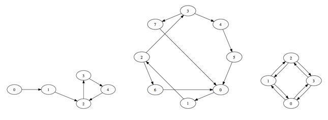

## 문제

Luke likes to ride on public transit in different cities he visits, just for fun. He tries to find unique ways to travel in loops: leaving from one transit station, traveling along the transit connections to at least one other station, and returning to the station where he started. He is finding lots of loops, and he wants to know just how many there are in different transit systems. There may be so many he won’t ever have time to try them all, but he’ll find some satisfaction in knowing they are there.

He’s particularly interested in counting simple loops. A simple loop is a sequence of unique transit stations t1, t2, . . . , tj , where there’s a way to connect directly from ti to ti+1 for 1 ≤ i < j and also from tj to t1. Of course, we can write down a simple loop starting with any of the stations in the loop, therefore we consider any cyclic shift of such a sequence to be the same simple loop. However, two simple loops which visit the same set of transit stations in a different order are considered distinct.

Help Luke by writing a program to count how many unique simple loops there are in each transit system. The following figures illustrate the transit stations (numbered ovals) and one-way connections (arrows) of the sample input.

## 입력

Input contains a description of one transit system. The description begins with a line containing an integer 3 ≤ m ≤ 9 indicating the number of transit stations in the system. Stations are numbered 0 to m − 1. The next line contains an integer 1 ≤ n ≤ m(m−1) indicating the number of connections that follow, one connection per line. Each connection is a pair of integers s t (0 ≤ s < m, 0 ≤ t < m, s ≠ t), indicating that there is a one-way connection from station s to station t.

## 출력

Print the number of unique simple loops in the transit system.
