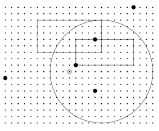

## 문제

A fundamental operation in computational geometry is determining whether two objects touch. For example, in a game that involves shooting, we want to determine if a player’s shot hits a target. A shot is a two dimensional point, and a target is a two dimensional enclosed area. A shot hits a target if it is inside the target. The boundary of a target is inside the target. Since it is possible for targets to overlap, we want to identify how many targets a shot hits.

The figure above illustrates the targets (large unfilled rectangles and circles) and shots (filled circles) of the sample input. The origin (0, 0) is indicated by a small unfilled circle near the center.

## 입력

Input starts with an integer 1 ≤ m ≤ 30 indicating the number of targets. Each of the next m lines begins with the word rectangle or circle and then a description of the target boundary. A rectangular target’s boundary is given as four integers x1 y1 x2 y2, where x1 < x2 and y1 < y2. The points (x1, y1) and (x2, y2) are the bottom-left and top-right corners of the rectangle, respectively. A circular target’s boundary is given as three integers x y r. The center of the circle is at (x, y) and the 0 < r ≤ 1000 is the radius of the circle.

After the target descriptions is an integer 1 ≤ n ≤ 100 indicating the number of shots that follow. The next n lines each contain two integers x y, indicating the coordinates of a shot. All x and y coordinates for targets and shots are in the range [−1000, 1000].

## 출력

For each of the n shots, print the total number of targets the shot hits.
