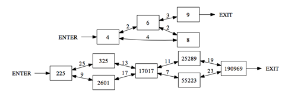

## 문제

Your boss gave you the task of creating a walking maze, and you are evaluating different designs. Before you commit to one, you want to know how quickly people can move in and out of each different maze. After all, your boss is interested in making money on this venture and, the faster people can move through, the more paying customers you can handle.

A maze is a set of numbered rooms and passages connecting the rooms. The maze’s only entrance is at the lowest-numbered room and the only exit is at the highest-numbered room.

Each passage has a limit in the number of people that can pass through at a time. For two rooms numbered x and y, if x and y have a common factor greater than one, then there is a passage between x and y. The largest common factor p is the number of people per minute that can walk from x to y. Simultaneously, p people per minute can also be walking from y to x. The entrance, exit, and rooms can handle any number of people walking through at a time. People want to get through the maze as quickly as possible, so they do not wait around in the rooms.

Here are illustrations of the two sample inputs. Boxes represent the numbered rooms, and each arrow is a passage labeled by the number of people per minute that can walk through it.

## 입력

Input is a single maze description. The first line is an integer 2 ≤ n ≤ 1000 indicating the number of rooms in the maze. This is followed by n unique integers, one per line, which are the room numbers for the maze. Each room number is in the range [2, 2 × 109].

## 출력

Print the maximum number of people per minute that can enter the maze, assuming that people are exiting the maze at the same speed as people entering. No maze supports more than 109 people entering per minute.
