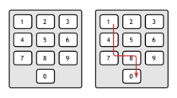

## 문제

Good morning! This is your 5am wake-up call! A partly cloudy day is expected with light rain coming afternoon...

You have just woken up. You desperately need coffee... and... more coffee... and some cereal. And your clothes. And coffee.

To prepare warm cereal, you put some milk into a microwave, trying to heat it for k seconds. You must enter k on the microwave keyboard:

As you still haven’t had your coffee, your hand (along with eyes and brain) keeps falling down. You are only able to enter a number if your hand would only move downwards and/or to the right. You cannot go back left, nor move your hand up, though you can press the same key again. And again... and again...

For example, you can enter the number 180 or 49, but not 98 or 132. Enter a number that is as close to k as possible. If there are two solutions, enter any one of them. You are too sleepy to actually care. And you need coffee.

## 입력

The first line of input contains the number of test cases T. The descriptions of the test cases follow:

Each test case consists of one line containing an integer k (1 ≤ k ≤ 200).

## 출력

For each test case, output a number that is closest to k which can be entered on the keyboard
