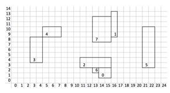

## 문제

덕휘는 로맨틱펀치의 팬이다. 어느 날 그가 사는 마을에 로맨틱펀치가 락페스티벌 행사에 초청받아 공연을 왔다! 덕휘는 기뻐 날뛰기 시작했다. 그러나 마을 사람들은 조용한 것을 좋아해서 로맨틱펀치를 내쫓았다. 덕휘는 화가 나서 이렇게 된 이상 자신의 저택 뒤뜰에 로맨틱펀치를 초청하여 공연을 부탁하려고 한다.

그러나 뒤뜰을 쓴 지 오래돼서 이곳저곳에 잡초가 자라 있다. 잡초를 깎기는 귀찮은 덕휘는 남아있는 맨땅 중 그 면적이 가장 넓은 곳을 무대로 쓰려고 한다. 맨땅은 여러 개의 직사각형들로 이루어져 있고, 인접해 있는 직사각형들은 하나의 맨땅으로 친다. 이때, 모서리에서만 만나는 두 땅도 인접한 것으로 친다.

덕휘의 저택 뒤뜰에 있는 맨땅들 중 가장 넓은 면적은 얼마인지 알아내시오.

## 입력

첫 번째 줄에는 잡초가 없는 땅 정보의 개수 N이 주어진다. (0 < N ≤ 50,000)

이어서 각 줄에 땅의 위치와 넓이 정보가 직사각형 형태로 주어진다. 차례대로 X, Y, W, H이며, 이는 땅의 제일 왼쪽 아래 지점이 (X, Y)이고 너비가 W, 높이가 H라는 뜻이다. 모든 땅의 변은 x축, y축에 평행하다. (0 < W, H ≤ 500)

입력으로 주어지는 땅의 모서리 좌표와 면적 값은 모두 32bit 정수 자료형으로 처리 가능하다. 또한, 입력의 모든 직사각형은 서로 겹치지 않는다.

## 출력

첫째 줄에 가장 넓은 땅 묶음의 면적을 출력한다.

## 힌트

예제를 그림으로 나타내면 다음과 같다.

그림에는 총 4개의 땅 묶음이 존재한다.

* 3, 4번: 넓이 16
* 7, 1번: 넓이 20
* 0, 2, 6번: 넓이 15
* 5번: 넓이 16

따라서 가장 큰 면적은 20이다.
