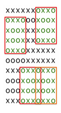

## 문제

재혁이는 화가인데 거지다. 그래서 새 그림을 그릴 화판조차도 없다. 그러나 재혁이는 방금 유레카를 외쳤다. "아직 팔리지 않은 그림들을 꿰매 이어붙여서 새로운 큰 그림을 만들면 화판도 필요없고 새 그림도 만들고 개이득이다. 이거 완전 빅 픽쳐 아님?" 꼬박 하루의 노동을 거쳐, 재혁이는 큰 그림 걸작 하나를 만들어내고야 말았다.

그러던 어느 날, 재혁이는 예상치 못한 전화를 받고 말았다. 전화의 내용은 아직 팔리지 않았던 그림 중 하나를 사겠다는 것이었다. 그런데 재혁이는 큰 그림을 만드는 데 어떤 그림들을 사용했는지 기록하는 것을 까먹었다. 그래서 자기 걸작의 어느 곳에 그 그림이 사용되었는지를 찾아야 한다.

흑백으로 표현된 그림과 그걸 사용해 만든 걸작이 주어졌을 때, 재혁이가 그림을 찾는 것을 도울 수 있는가?

## 입력

첫 번째 줄에 4개의 정수 hp wp hm wm가 주어진다. 각각 사용한 그림의 높이와 너비, 걸작의 높이와 너비를 의미한다. 이어서 hp개의 줄에 걸쳐 사용한 그림이 주어지고, hm개의 줄에 걸쳐 걸작이 주어진다. 그림은 'x' 또는 'o'만으로 이루어져 있다.

각 그림의 너비와 높이는 1 이상 2000 이하이며, 걸작의 넓이와 높이는 각각 사용한 그림의 너비와 높이보다 크거나 같다.

## 출력

사용한 그림이 걸작에서 있을 수 있는 위치의 개수를 출력한다.

## 힌트

