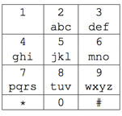

## 문제

메뚜기 재석이는 간만에 목초지에서 신났당. 무지무지 신났당. 너무너무 신나서 뛰어놀다가 그만!! 핸드폰을 물웅덩이에 빠뜨리고 말았다. 그 덕에 핸드폰은 젖어버렸고, 자판은 요상하게 작동한다. 자판의 키 중 하나를 누르면, 마치 다른 키를 누른 것처럼 동작한다. 다행히도, 두 키가 같은 동작을 하지는 않기 때문에 재석이는 모든 문자를 입력할 수 있다.

재석이는 자판을 눌러보면서 어떤 키가 어떤 동작을 하는지를 모두 알아냈다. 이제 문자를 보내려는데, 재석이는 메뚜기라서 누군가의 도움이 필요할 것 같다.

이 그림은 핸드폰의 자판이다(안타깝게도 재석이는 메뚜기라 스마트폰을 사지 못 했다.). 예를 들어, a를 입력하고 싶으면 2를 한 번 누르면 되고, b를 입력하고 싶으면 2를 두 번 누르면 된다. 만약 똑같은 키를 연속해서 눌러 다른 문자를 입력하고 싶으면 #을 누르면 된다. 예를 들어, klor을 입력하고 싶으면 55#555666777을 눌러 입력하면 된다.

## 입력

첫째 줄엔 9개의 정수가 주어진다. 첫 번째 정수는 1번 키를 누르면 원래 자판에서 어떤 키를 누른 것처럼 동작하는지, 두 번째 정수는 2번 키를 누르면 원래 자판에서 어떤 키를 누른 것처럼 동작하는지...이런 식이다.

재석이는 \*이랑 0은 쓸 수가 없다. #키는 망가지지 않았다.

두 번째 줄엔 소문자로 된 문자열이 주어진다. 길이는 100 문자를 넘지 않는다.

## 출력

재석이의 메세지를 쓰기 위해 눌러야 하는 키를 출력한다.

## 힌트

Clarification of the first example: All of the keys are shifted one place to the right so the output differs a little bit from the example in the task statement.
