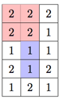

## 문제

Little Bob is a famous builder. He bought land and wants to build a house. Unfortunately, the problem is the land’s terrain, it has a variable elevation.

The land is shaped like a rectangle, N meters wide and M meters long. It can be divided into N·M squares (see the image). Bob’s house will be shaped like a rectangle that has sides parallel with the land’s edges and its vertices coincide with the vertices of the squares. All the land covered by Bob’s house must be of equal elevation to prevent it from collapsing.

The land divided into squares.  
Two possible locations of house are marked with red and blue.

Calculate the number of ways Bob can build his house!

## 입력

The first line of input contains integers N and M (1 ≤ N, M ≤ 1 000).

Each of the following N lines contains M integers aij (1 ≤ aij ≤ 109), respectively the height of each square of land.

Warning: Please use faster input methods beacuse the amount of input is very large. (For example, use scanf instead of cin in C++ or BufferedReader instead of Scanner in Java.)

## 출력

The first and only line of output must contain the required number from the task statement.

## 힌트

Clarification of the first example: Some of the possible house locations are rectangles with opposite vertices in (0,0)-(1,1), (0,0)-(0,2) (height 2) i (2,0)-(2,2), (1,2)-(2,2) (height 1). The first number in the brackets represents the row number and the second one the column number (0-indexed).
