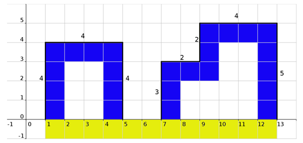

## 문제

The main hero of this task, painter Vincent, spent a great deal of his youth travelling the world. Sights from numerous voyages have often been the inspiration for his, nowadays highly praised, works of art. On one occasion, Vincent found himself in a metropolis full of skyscrapers so he got down to work right away, intoxicated by the marvelous sight. For a number of reasons, incomprehensible to an average programmer, Vincent decided to paint only the silhouettes of the skyscrapers seen before him. Unfortunately, a week after he finished this masterpiece, the painting spontaneously caught fire.

In order to reconstruct the painting, Vincent sought help in all directions; architects provided him with the exact dimensions of the skyscrapers, physicists ignored air resistance, mathematicians mapped everything onto a plane and now it’s your turn!

From your perspective, Vincent’s skyscrapers are rectangles whose sides are parallel to coordinate axes and with one side that lies on the abscissa. Part of the abscissa on the image should be shown with the characters ‘\*’, the silhouettes of the skyscrapers with ‘#’ and fill the rest of the image with ‘.’. The left edge of the image must begin with a skyscraper, whereas the right edge of the image must end with a skyscraper. Additionally, in order to verify the results the mathematicians got, output the perimeter of the given silhouette not calculating the sides that lie on the abscissa.

## 입력

The first line of input contains an integer N (1 ≤ N ≤ 10 000), the number of skyscrapers.

Each of the following N lines contains three integers Li, Ri and Hi (1 ≤ Li, Ri, Hi ≤ 1, 000, 3 ≤ Ri - Li ≤ 1, 000) that describe the position of the ith skyscraper. That skyscraper, in a Cartesian coordinate system, is considered a rectangle with its lower left corner in (Li, 0) and upper right corner in (Ri, Hi).

## 출력

The first line of output must contain the perimeter of Vincent’s silhouette.

The next h+1 lines, where h+1 is the height of the highest skyscraper, must contain Vincent’s drawing as described in the task.

## 힌트

Clarification of the first example: Blue color denotes the skyscrapers’ silhouette (character ‘#’), whereas yellow is the part of abscissa located on Vincent’s painting (character ‘\*’).

