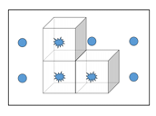

## 문제

A three-dimensional grid of atomic energy cells aboard the starship PacificNorthwestPassage is reporting failures on several of its cells. The ship’s engineer must set up enclosures that will contain all cells reported to be failing in order to avoid a meltdown. It is imperative that the enclosures be finished in the shortest amount of time, even if that requires some healthy cells to be enclosed along with the defective ones. The enclosures are formed by panels which can only be inserted between cells (so each individual panel must be axis-aligned), and each panel separates exactly two cells and requires one minute to set up. For full containment, each enclosure must form a closed polytope. Given the coordinates of each defective cell, report how long it will take to finish containing the problem.

## 입력

The input will start with a single line containing the number N giving the number of test cases, 1 ≤ N ≤ 100. Each test case will start with a single line giving the number F, 1 ≤ F ≤ 100, the number of failing cells. Following this will be F lines each with three integers xi, yi, zi, all between 0 and 9, inclusive, giving the locations of the failing cells. For each test case, each triple (xi, yi, zi) will be unique.

## 출력

For each test case, print on a single line the minimum number of minutes required to fully contain the problem.
