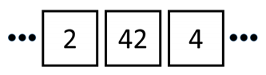

## 문제

Alice와 Bob은 N개의 정사각형을 일렬로 놓고 게임을 하고 있다. 정사각형에는 1부터 N까지의 수가 하나씩 적혀져 있다.

Alice와 Bob은 턴을 번갈아가면서 수를 하나씩 제거한다. 어떤 정사각형에 적혀있는 수를 제거하려면, 변을 공유하는 양쪽 정사각형에 더 큰 수가 있으면 안 된다. 수를 제거하면, 정사각형에는 수가 적혀있지 않은 상태가 된다.

1을 제거하는 사람이 게임을 승리한다. 게임의 초기 상태가 주어졌을 때, 두 사람이 최적의 방법으로 게임을 한다면, 누가 이기는지 구하는 프로그램을 작성하시오.

## 입력

첫째 줄에 테스트 케이스의 개수 T (1 ≤ T ≤ 100) 가 주어진다. 각 테스트 케이스의 첫째 줄에는 N (1 ≤ N ≤ 100)이 주어진다. 다음 줄에는 게임의 초기 상태가 왼쪽부터 오른쪽까지 순서대로 주어진다.

## 출력

각각의 테스트 케이스에 대해서, 게임을 승리하는 사람을 출력한다.
