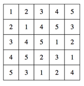
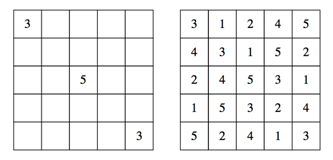
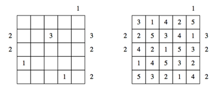

## 문제

The Towers puzzle challenges a single player to place towers of varying heights in an n x n grid (3 ≤ n ≤ 5). The heights of each tower can be any integer between 1 and n, inclusive, but the placement of the n2 towers must be such that no tower of the same height appears twice within the same row or column. Given no other constraints, there is an exponentially large number of ways to place towers. Take, for example, the 5 x 5 puzzle, where one of the solutions looks like this:

The puzzles become more interesting (and harder to solve) as they further constrain that one or more grid locations be occupied by towers of specified heights. A 5 x 5 puzzle, for instance, might require that the upper left and lower right corners house towers of height 3, and that the center location house a tower of height 5. The puzzle would look like that on the left below, and a solution—again, one of many—might look like that presented to its right.

Some puzzles include one or more numbers around the perimeter, where each number specifies the exact number of towers visible when looking into the grid from that direction, with the understanding that taller towers fully conceal shorter ones. For example, the 5 x 5 puzzle presented below and on the left would have the (incidentally unique) solution to its right.

The number above the final column requires that just a single tower be visible when viewing its sequence of five towers from above (which essentially means that the top row of that column must house a 5.) The second row introduces multiple requirements:

* the center column must house a 3,
* exactly two towers are visible when viewing its tower sequence from the left, and
* exactly three towers are visible when viewing its two sequence from the right.

## 입력

The input starts with a single integer on a line by itself, giving the number of tests; there will be at least 1 but no more than 100 test cases. Each n × n puzzle (3 ≤ n ≤ 5) is expressed as a series of n + 2 lines of length n + 2. The outer perimeter of the grid specifies the visibility constraints (where ‘-’ expresses there are no constraints for that row or column from the relevant direction looking in; the corners of the perimeter are always ‘-’] and the interior of the grid specifies those locations where a tower of a specific height must be placed (where ‘-’ expresses there is no imposed tower height for that location.)

We guarantee that every character in the grid is either a ‘-’ or a digit between 1 and n.

## 출력

For each input puzzle, output a solution as a sequence of n lines, each of length n, followed by a blank line. If a puzzle has multiple solutions, then output lexicographically smallest one among them. If a puzzle cannot be solved, simply print the word “no”, all by itself, without the delimiting double quotes, followed by a blank line.
