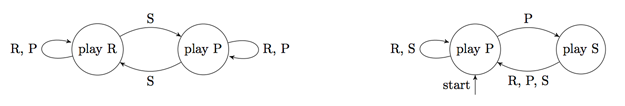

## 문제

A game of rock-paper-scissors is played by two players who simultaneously show out their moves: Rock, Paper , or Scissors. If their moves are the same, it’s a draw. Otherwise, Rock beats Scissors, Paper beats Rock, and Scissors beat Paper .

The described procedure can be repeated many times. In this problem, two Finite State Machines (FSMs) will compete in a series of rounds. (Formally speaking, by FSMs we mean Moore machines in this problem.)

An FSM for playing rock-paper-scissors has finitely many states. Each state is described by the following: what move the FSM will make in the upcoming round, and what will be the new state in case of its opponent playing Rock, Paper , and Scissors.

Fortunately, you know your opponent FSM — the entire scheme except for one thing: you do not know the initial state of that FSM.

Your task is to design your own FSM to fight the given one. Your FSM must beat the opponent in at least 99% of the first 1 billion rounds. That’s what we call an epic win!

## 입력

The input file contains a description of the opponent FSM in the following format.

The first line contains an integer n (1 ≤ n ≤ 100) — the number of states in the FSM. States are numbered from 1 to n. Each of the following n lines contains a description of the state: a character ci denoting the move made by FSM and integers ri, pi, si denoting the next state in case of seeing Rock, Paper, or Scissors respectively (ci can be ”R”, ”P”, or ”S”; 1 ≤ ri, pi, si ≤ n

## 출력

Write to the output the description of your FSM in the same format.

The initial state of your FSM is the first state.

The number of states may not exceed 50 000.

## 힌트

The picture in the problem statement illustrates the opponent FSM given in the above sample input and a possible solution of yours given in the sample output.

Opponent FSM keeps playing Rock or Paper (depending on its initial state) until it sees Scissors — seeing Scissors triggers a change in its behaviour.

One way to beat such FSM is to play Paper . If your opponent keeps playing Rock, just continue playing Paper and thus win. If the opponent FSM is playing Paper , trigger it to playing Rock by playing Scissors once, and then it’ll keep playing Rock and you’ll keep beating it with your Paper .
