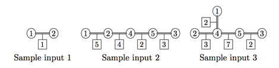
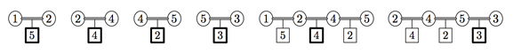
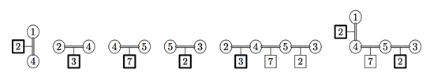

## 문제

Helen and Henry are fans of the TV show “Hidden Maze”, which is very popular in Hiddenland. During this show two participants (usually a married couple) are rushing through the maze consisting of n halls connected by some tunnels. Each tunnel connects two different halls and there can’t be more than one tunnel connecting any pair of halls.

In the beginning of the show, two participants are placed in two different halls. Then they need to move very quickly to meet each other before the time runs out. To pass through each tunnel, the participant needs to find a clue which is some positive integer number written on a small piece of paper.

If the participants finally meet in some tunnel before the time runs out, and successfully find a clue contained in the tunnel where they met, they are considered winners. The value of their prize is calculated by sorting all the clues found by them and taking the median value. The game is always set up in such a way, that the number of clues they find is odd.

Helen and Henry saw a large number of episodes of the show, and now they understand a lot about the mechanics of it. They noticed that the maze doesn’t change between episodes, and they drew a complete map of the maze. Shortly after, Helen and Henry have discovered that the maze is built in such a manner that if you visit any tunnel at most once, then there is exactly one path between any two halls.

Helen and Henry have been wondering how this great maze is created, and not so long time ago they have seen an interview with Hillary, who worked for the company which had built the maze. Hillary has told that to make the show fair, the maze had been created using the following randomized algorithm:

1. Pick the number of halls n. Build n halls enumerated from 1 to n.
2. Choose at random two integers i and j, each of them uniformly distributed between 1 and n.
3. If halls i and j are the same or are already connected with some path of tunnels, then go to step 2.
4. Build the tunnel between i and j. If there is a path of tunnels from any hall to any other one, stop the process, otherwise go to step 2.

Helen and Henry have also noticed that each tunnel contains exactly one clue and its value never changes from episode to episode. However, they don’t know what algorithm was used to generate clue values. Helen and Henry have written on their map the value of the clue for each tunnel.

It always takes 1 minute to find a clue and to run through the tunnel from one hall to another. It takes half a minute to run from the hall to the center of the tunnel when the participants meet in the center of the tunnel at the end. The time given to participants is only enough to meet each other if they act optimally, that is they just run to each other via the shortest possible path, never make mistakes when finding clues, and never turn into any other tunnels that do not belong to the shortest path. To make the participants meet in the center of some tunnel, they are placed in the beginning of the show in such a way that the length of the shortest path between the halls where they are placed is odd.

Helen and Henry want to participate in the show. They know the maze by heart and they are pretty sure that they will succeed in moving optimally to each other and finding all clues in time. Provided that the pair of initial halls is selected uniformly from all pairs with an odd-length shortest path between them, they need to know the expected value of the prize they win. Your task is to help them find this expected value.

## 입력

The first line of the input contains an integer number n (2 ≤ n ≤ 30 000) — the number of halls. Each of the following n − 1 lines contains three integers: ui, vi, ci (1 ≤ ui, vi ≤ n, 1 ≤ ci ≤ 106), describing the i-th tunnel connecting the halls ui and vi, containing the clue with the value ci. The maze is always created by the randomized algorithm that is specified in the problem statement.

## 출력

Write to the output file a single real number — the expected value of the prize. The absolute or relative error of the answer must not exceed 10−9.

## 힌트

You can look at the pictures of mazes from the sample inputs below. The halls are shown as circles, the tunnels are gray lines and the clues are squares.

There are six possible pairs of initial halls in the second sample maze. They are shown on the picture below, the clue used to determine the prize is marked with bold frame. The expected value is

(4 + 5 + 2 + 3 + 4 + 3)/6 = 21/6 = 3.5

All six possible initial pairs for the third maze are shown on the picture below, the expected value is calculated as

(2 + 3 + 7 + 2 + 3 + 2)/6 = 19/6 = 3.16666666666 . . .

Note that in this case there are two clues with number 2 for the pair (1, 3), which is shown on the rightmost picture. Any one of them can be selected as the median (they are both marked with bold frame) but this obviously does not change the value of the prize.
