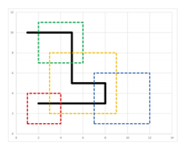

## 문제

Due to the increased robbing in the Silk route, the number of merchants travelling through the Silk route is getting less and less. Each robber at any place on the route requests money as much as possible from passing merchants. Now, merchants prefer not to travel through the Silk route even if their travel distances increase by choosing other routes. This has reduced the income of robbers and now Moradbeig, the cheif chair of the robbers, has been forced to set up a new robbing system, namely the toll system. Based on this system, each robber is restricted to a specific square-like area (including the boundary), so-called the robber territory, with no assumption on territories to be disjoint. More importantly, the toll fee is set to be exactly 1 Oshloob inside each territory. The other rules of the new system is listed below.

1. A robber can not get the toll fee outside his territory at all.
2. Each robber must issue a passing ticket, specific to the robber territory, for a merchant who pays the toll fee to him. This ticket allows the merchant to freely travel inside the territory without paying more toll to the other robbers. Once the merchant goes outside the territory, the ticket automatically gets invalid and it can not be used any more.
3. Without any valid ticket, a merchant can not pass through the territories of the robbers.
4. If a merchant likes, he himself can make his current ticket invalid and get a new ticket from any robber whose territory covers him.

Marco Polo, a wealthy merchant, is planning to travel through the Silk route from the beginning to the end. Although the situation is better compared to the past, he still thinks of paying less toll. Your job is to write a program that computes the minimum toll that Marco Polo has to pay in order to traverse the whole route. For simplicity, you can assume the Silk route is a rectilinear path, i.e., each segment of the path is either horizontal or vertical.

## 입력

There are multiple test cases in the input. Each test case starts with a line containing two positive integers n and m (n, m ⩽ 1000) which are the numbers of territories and the number of vertices of the Silk route, respectively. The next n lines describe the territories; one territory per line. Each line contains non-negative integers x, y and k (x, y ⩽ 106, k ⩽ 1000) where (x, y) is the lowest and leftmost corner of the territory and k is the side length of the territory. Each of the next m lines presents the coordinates of the vertices of the Silk route in the order of appearing on the route. It is guaranteed that the route does not intersect itself. The input terminates with a line containing 0 0 which should not be processed.

## 출력

For each test case, output a line containing the minimum toll that must be paid by Marco Polo.
