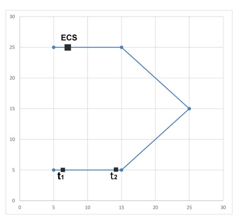

## 문제

The International competition of Robot Race 2014 will be held in Tehran. In the competition, a path is specified by the scientific committee, and each robot has to move along the path, from the beginning to the end.

There is an electronic charge station (ECS) on the path, at which robots charge their batteries. Every robot have a device which tells its distance to the ECS. Unfortunately, the devices are not good enough, so, each device shows the Euclidean distance of the robot to the ECS, not the remaining distance on the path to the ECS.

Kamran is a member of the scientific committee of the competition. He knows that there is a common bug in the control software of some robots. A buggy robot imagines that its device shows the remaining distance on the path to the ECS, not the the Euclidean distance to the ECS. As a consequence, from the buggy-robot point of view, its device must show a decreasing sequence of numbers before reaching to the ECS. If this is not the case, the buggy robot crashes since it thinks that it has already passed the ECS without getting charged. Kamran considers a given competition path as unfair, if he can choose a position for ECS on the path such that the buggy robots crash in some time. In other words, a path is unfair if an ECS position can be chosen and there exist three times t1 < t2 < t3 such that a robot is at ECS at time t3 and |pt1 pt3| < |pt2 pt3| where |ab| denotes the Euclidean distanceb between a and b and pt is the position of the robot at time t. The scientific committee has proposed a list of possible paths for the competition, and Kamran wants to know which path is fair (i.e, the path is not unfair).

## 입력

There are multiple test cases in the input. The first line of each test case contains a positive integer n (n ⩽ 10, 000), which is the number of points on the path. The next n lines contain n pair of integers x and y (−106 ⩽ x, y ⩽ 106). The i-th pair specifies the coordinate of the i-point in the path. Robots have to start from the first point, and pass through the segments joining consecutive points each after other, and stop when they reach the last point. It is guaranteed that the path does not intersect itself. The input terminates with a line containing 0 which should not be processed.

## 출력

For each test case, output a line containing either Fair or Unfair depending on whether the given path is fair or unfair, respectively.
