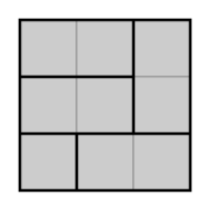
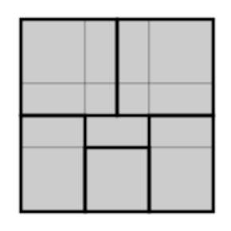

## 문제

Stanko is working as an architect in a construction company. His current task is to make a ground plan for a residential building located in Zagreb. He must determine a way to split the floor building with walls to make apartments in the shape of a rectangle. Each built wall must be parallel to the building’s sides.

More precisely, the floor is represented in the ground plan as a large rectangle with dimensions N ×M, where each apartment is a smaller rectangle with dimensions a × b located inside of a larger one. The numbers a and b must be integers.

Additionally, the floor must be completely covered with apartments – each point in the floor must be located in an apartment. The apartments must not intersect, but they can touch.

To prevent darkness indoors, the apartments must have windows. Therefore, each apartment must share its side with the edge of the rectangle representing the floor so it is possible to place a window.

Moreover, all apartments must have the approximately equal area K. The deviation of an area of an apartment with dimensions a × b is defined as (a · b − K)2. The deviation of a ground plan is the sum of all the apartment’s deviations.

Stanko wants to build the best building he can, a building with minimal deviation. Help him and write a programme to determine the minimal possible deviation of a ground plan which satisfies the conditions from the task.

(a) A valid arrangement of apartments corresponding to the first example.

(b) An invalid arrangement of apartments. The length of apartments’ sides are not integers and there is an apartment without windows.

## 입력

The first and only line of input contains the integers N, M, K (1 ≤ N, M ≤ 300, 1 ≤ K ≤ 10 000).

## 출력

The first and only line of output must contain the minimal possible deviation of the arrangement of apartments.
