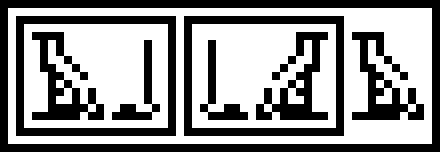
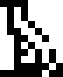
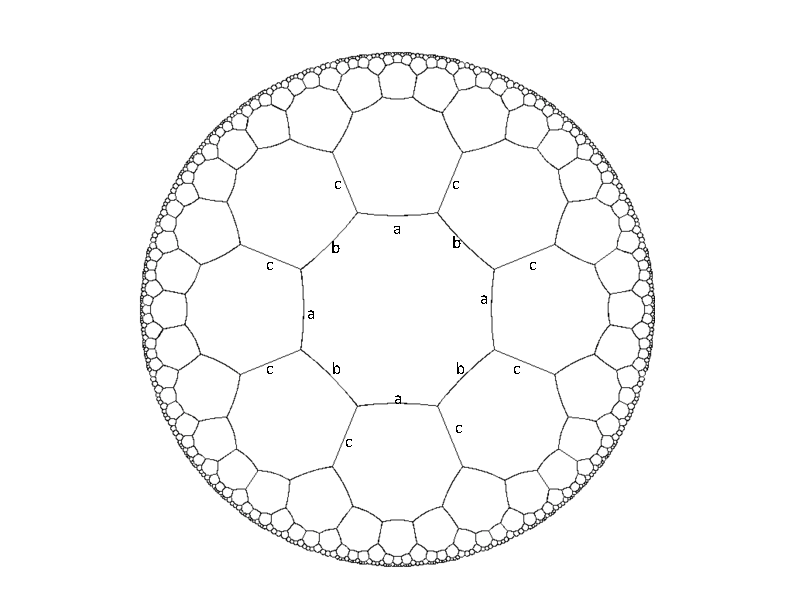
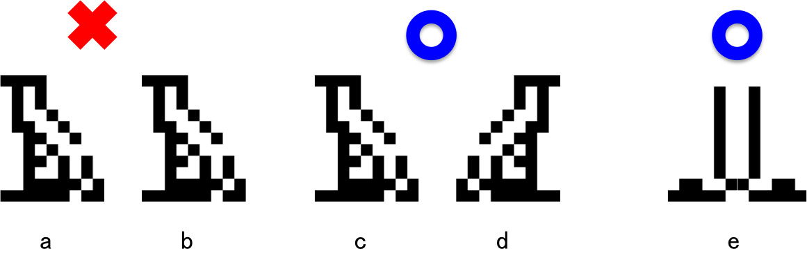

## 문제

One day in a forest, Alice found an old monolith.



She investigated the monolith, and found this was a sentence written in an old language. A sentence consists of glyphs and rectangles which surrounds them. For the above example, there are following glyphs.

 

Notice that some glyphs are flipped horizontally in a sentence.

She decided to transliterate it using ASCII letters assigning an alphabet to each glyph, and `[` and `]` to rectangles. If a sentence contains a flipped glyph, she transliterates it from right to left. For example, she could assign `a` and `b` to the above glyphs respectively. Then the above sentence would be transliterated into `[[ab][ab]a]`.

After examining the sentence, Alice figured out that the sentence was organized by the following structure:

* A sentence <seq> is a sequence consists of zero or more <term>s.
* A term <term> is either a glyph or a <box>. A glyph may be flipped.
* <box> is a rectangle surrounding a <seq>. The height of a box is larger than any glyphs inside.

Now, the sentence written on the monolith is a nonempty <seq>. Each term in the sequence fits in a rectangular bounding box, although the boxes are not explicitly indicated for glyphs. Those bounding boxes for adjacent terms have no overlap to each other. Alice formalized the transliteration rules as follows.

Let \(f\) be the transliterate function.

Each sequence \(s = t\_1 t\_2 ... t\_m\) is written either from left to right, or from right to left. However, please note here \(t\_1\) corresponds to the leftmost term in the sentence, \(t\_2\) to the 2nd term from the left, and so on.

Let's define \(ḡ\) to be the flipped glyph \(g\). A sequence must have been written from right to left, when a sequence contains one or more single-glyph term which is unreadable without flipping, i.e. there exists an integer \(i\) where \(t\_i\) is a single glyph \(g\), and \(g\) is not in the glyph dictionary given separately whereas \(ḡ\) is. In such cases \(f(s)\) is defined to be \(f(t\_m) f(t\_{m-1}) ... f(t\_1)\), otherwise \(f(s) = f(t\_1) f(t\_2) ... f(t\_m)\). It is guaranteed that all the glyphs in the sequence are flipped if there is one or more glyph which is unreadable without flipping.

If the term \(t\_i\) is a box enclosing a sequence \(s'\), \(f(t\_i) = \)`[`\( f(s') \)`]`. If the term \(t\_i\) is a glyph \(g\), \(f(t\_i)\) is mapped to an alphabet letter corresponding to the glyph \(g\), or \(ḡ\) if the sequence containing \(g\) is written from right to left.

Please make a program to transliterate the sentences on the monoliths to help Alice.

## 입력

The input consists of several datasets. The end of the input is denoted by two zeros separated by a single-space.

Each dataset has the following format.

```

n m
glyph1
...
glyphn
string1
...
stringm
```

\(n\) (\(1\leq n\leq 26\)) is the number of glyphs and \(m\) (\(1\leq m\leq 10\)) is the number of monoliths. \(glyph\_i\) is given by the following format.

```

c h w
b11...b1w
...
bh1...bhw
```

\(c\) is a lower-case alphabet that Alice assigned to the glyph. \(h\) and \(w\) (\(1 \leq h \leq 15\), \(1 \leq w \leq 15\)) specify the height and width of the bitmap of the glyph, respectively. The matrix \(b\) indicates the bitmap. A white cell is represented by `.` and a black cell is represented by `*`.

You can assume that all the glyphs are assigned distinct characters. You can assume that every column of the bitmap contains at least one black cell, and the first and last row of the bitmap contains at least one black cell. Every bitmap is different to each other, but it is possible that a flipped bitmap is same to another bitmap. Moreover there may be symmetric bitmaps.



\(string\_i\) is given by the following format.

```

h w
b11...b1w
...
bh1...bhw
```

\(h\) and \(w\) (\(1 \leq h \leq 100\), \(1 \leq w \leq 1000\)) is the height and width of the bitmap of the sequence. Similarly to the glyph dictionary, \(b\) indicates the bitmap where A white cell is represented by `.` and a black cell by `*`.

There is no noise: every black cell in the bitmap belongs to either one glyph or one rectangle box. The height of a rectangle is at least 3 and more than the maximum height of the tallest glyph. The width of a rectangle is at least 3.

A box must have a margin of 1 pixel around the edge of it.

You can assume the glyphs are never arranged vertically. Moreover, you can assume that if two rectangles, or a rectangle and a glyph, are in the same column, then one of them contains the other. For all bounding boxes of glyphs and black cells of rectangles, there is at least one white cell between every two of them. You can assume at least one cell in the bitmap is black.

## 출력

For each monolith, output the transliterated sentence in one line. After the output for one dataset, output `#` in one line.
