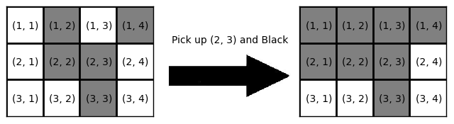

## 문제

You have a rectangular board with square cells arranged in \(H\) rows and \(W\) columns. The rows are numbered \(1\) through \(H\) from top to bottom, and the columns are numbered \(1\) through \(W\) from left to right. The cell at the row \(i\) and the column \(j\) is denoted by \((i, j)\). Each cell on the board is colored in either Black or White.

You will paint the board as follows:

1. Choose a cell \((i, j)\) and a color \(c\), each uniformly at random, where \(1 \le i \le H\), \(1 \le j \le W\), and \(c \in \{{\rm Black}, {\rm White}\}\).
2. Paint the cells \((i', j')\) with the color \(c\) for any \(1 \le i' \le i\) and \(1 \le j' \le j\).

Here's an example of the painting operation. You have a \(3 \times 4\) board with the coloring depicted in the left side of the figure below. If your random choice is the cell \((2, 3)\) and the color Black, the board will become as shown in the right side of the figure. \(6\) cells will be painted with Black as the result of this operation. Note that we count the cells "painted" even if the color is not actually changed by the operation, like the cell \((1, 2)\) in this example.

Fig: An example of the painting operation

Given the initial coloring of the board and the desired coloring, you are supposed to perform the painting operations repeatedly until the board turns into the desired coloring. Write a program to calculate the expected total number of painted cells in the sequence of operations.

## 입력

The input consists of several datasets. The number of datasets is at most \(100\).

The first line of each dataset contains two integers \(H\) and \(W\) (\(1 \le H, W \le 5\)), the numbers of rows and columns of the board respectively. Then given are two coloring configurations of the board, where the former is the initial coloring and the latter is the desired coloring. A coloring configuration is described in \(H\) lines, each of which consists of \(W\) characters. Each character is either B or W, denoting a Black cell or a White cell, respectively. There is one blank line between two configurations, and also after each dataset. You can assume that the resulting expected value for each dataset will not exceed \(10^9\).

The input is terminated by a line with two zeros, and your program should not process this as a dataset.

## 출력

For each dataset, your program should output the expected value in a line. The absolute error or the relative error in your answer must be less than \(10^{-6}\).
