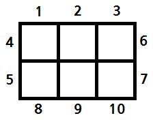
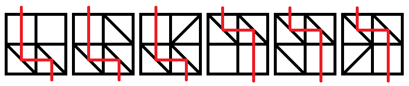

## 문제

어린 빛의 왕은 장난감을 좋아한다. 요즘 좋아하게 된 장난감은 \(N \times M\)크기인 직사각형 판의 각 칸에 대각선 모양의 거울을 꽂고 뺄 수 있는 장난감이다. 거울들을 적절하게 꽂아 넣은 다음에, 레이저를 어떤 테두리 칸의 중심을 향하고 그 칸의 변에 수직이게 쏘면 다른 칸으로 레이저가 나오는데 이것을 보고 신기해하며 좋아하는 것이다. 어린 빛의 왕은 테두리에 있는 각 칸에 아래와 같은 방법으로 자연수 번호를 하나씩 붙였다.

* 위쪽의 \(M\)개의 칸 : 왼쪽에서 오른쪽으로 \(1\)에서 \(M\)까지
* 왼쪽의 \(N\)개의 칸 : 위쪽에서 아래쪽으로 \(M+1\)에서 \(M+N\)까지
* 오른쪽의 \(N\)개의 칸 : 위쪽에서 아래쪽으로 \(M+N+1\)에서 \(M+N+N\)까지
* 아래쪽의 \(M\)개의 칸 : 왼쪽에서 오른쪽으로 \(M+N+N+1\)에서 \(M+N+N+M\)까지

예를 들어 \(2 \* 3\)크기의 직사각형 판의 테두리는 아래와 같이 번호 붙여지는 것이다.

어린 빛의 왕은 요즘 \(x\)에 레이저를 쏘면 \(y\)로 레이저가 나오는 장난감에 큰 관심을 가지고 있다. 또한 어린 빛의 왕은 특별한 배치의 장난감을 원하기 때문에 그가 원하는 거울의 배치가 길이가 \(M\)인 문자열 \(N\)개로 주어진다. 각 문자의 구성은 아래와 같다.

* **/** : 왼쪽에서 레이저가 들어오면 위쪽으로 반사, 위쪽에서 레이저가 들어오면 왼쪽으로 반사, 오른쪽에서 레이저가 들어오면 아래쪽으로 반사, 아래쪽에서 레이저가 들어오면 오른쪽으로 반사하는 거울.
* **\** : 왼쪽에서 레이저가 들어오면 아래쪽으로 반사, 위쪽에서 레이저가 들어오면 오른쪽으로 반사, 오른쪽에서 레이저가 들어오면 위쪽으로 반사, 아래쪽에서 레이저가 들어오면 왼쪽으로 반사하는 거울.
* **.** : 거울이 없어 레이저가 아무 방해를 받지 않고 지나갈 수 있는 칸.
* **?** : 위의 셋 중 어떤 것이라도 상관 없는 칸.

?의 개수에 따라 만들 수 있는 배치의 개수가 많아질 수 있다. 그 중 \(x\)에 레이저를 쏘면 \(y\)로 레이저가 나오는 배치의 개수를 구하는 프로그램을 작성하라.

## 입력

첫 번째 줄에 직사각형 판의 크기를 의미하는 두 정수 \(N\) ,\(M\) (\(1 \leq N,M \leq 8\))과 \(x,y\) (\(1 \leq x,y \leq 2(N+M)\)) 가 공백으로 구분되어 주어진다.

다음 \(N\)개의 줄의 각 줄에는 길이가 \(M\)인 문자열이 주어진다. 이 문자열은 '/', '\', '.', '?'로만 이루어져 있다.

이 문제는 두 개의 부분 문제로 이루어져 있다.

[1번 문제](./001_10725)의 입력은 '?'의 개수가 12개 이하이며 해결하면 10점을 얻을 수 있다.

[2번 문제](./002_10726)의 입력은  '?'의 개수가 64개 이하이며 해결하면 90점을 얻을 수 있다.

## 출력

첫 번째 줄에 \(x\)에 레이저를 쏘면 \(y\)로 레이저가 나오는 배치의 개수를 \(10,007\)로 나눈 나머지를 출력한다.

## 힌트

위의 6가지 이다.
