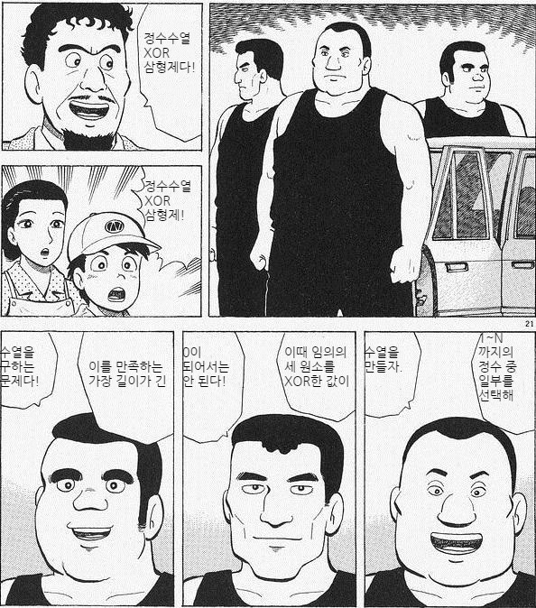

## 문제

(위에서 아래로, 오른쪽에서 왼쪽으로 읽어주세요.)

## 입력

첫 줄에 테스트 케이스의 수 \(T\)가 주어진다.

이어서 매 테스트 케이스마다 한 줄에 걸쳐 정수 \(N\) 이 주어진다.

이 문제는 두 개의 부분문제로 이루어져 있다.

[1번 문제](./001_10728)의 입력은 \(1 \leq n \leq 20\)을 만족하며 해결하면 20점을 얻을 수 있다.

[2번 문제](./002_10736)의 입력은 \(1 \leq n \leq 100\)을 만족하며 해결하면 80점을 얻을 수 있다.

## 출력

매 테스트 케이스마다 두 줄에 걸쳐서 답을 출력한다.

* 첫 줄에는 수열의 길이를 출력한다.
* 두 번째 줄에는 조건을 만족하는 수열을 공백으로 구분하여 출력한다. 만약 조건을 만족하는 수열이 여러 개라면, 아무 수열이나 하나 출력한다.
