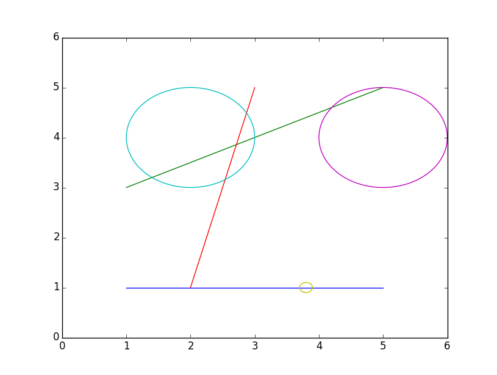

## 문제

안녕, 난 BOJ국 대통령 [august14](./001_august14)야. 내 이야기를 들어볼래?

BOJ국은 2차원 평면 위에 놓여 있어. 그래서 하늘을 나는 교통수단은 없고, 자동차가 가장 빠른 교통 수단이지.   
BOJ국은 국토를 효율적으로 사용하기 위해서 자동차가 다닐 수 있는 도로를 설치했어. 도로는 주어진 \(n\)개의 선분을 따라서 놓여있어. 모든 자동차는 도로 위에서만 움직일 수 있어.

널 찾은 건 사실 금번에 선거에 출마하면서 내 건 공약실천을 도와달라고 부탁하기 위해서야.

BOJ국 역시 다른 나라처럼 화재가 발생했을 때 소방서에서 가장 먼저 사고 현장으로 향하고는 해. 그런데 종종 소방차가 사고 현장에 빨리 다다르지 못해서 상황이 악화하는 일이 일어나곤 했어.  
그래서 새로이 제창하려는 법안이 있는데, 이 법안에 따르면 앞으로 BOJ국에서는 **소방차는 빨간불에도 멈추지 않아! ~~Boy~~**

다만, 소방차가 빨간불에도 멈추지 않고 사고 현장을 향해서 달려가려면 당연히 가장 가까운 소방서로부터 가장 가까운 경로를 통해서 현장에 도착할 줄 알아야겠지?  
즉, 출발해야 하는 소방서 및 최단경로를 화재가 일어난 즉시 소방서에서 숙지할 수 있어야만 실현 가능한 정책이라는 이야기야.

자동차 도로 위 \(m\) (\(1 \leq m \leq 100\))개의 점에 소방서가 있어.  
화재가 일어나면 소방차는 소방서 중 한 곳에서부터 출발할 거고, 소방차는 화재 장소로부터 반경 \(R\) 거리 안에 도착하게 되면 호스를 통해 화재를 진압할 수 있지.

BOJ국의 도로와 소방서의 위치, 그리고 \(Q\)개의 화재 장소가 주어질 때, 각각의 화재 장소에 대해서 가장 빠르게 도착할 수 있는 소방차의 이동 거리를 알고 싶어!

## 입력

첫 줄에는 테스트 케이스의 숫자 \(T\)가 정수로 주어진다.

매 테스트 케이스는 아래와 같이 구성된다.

* 첫 번째 줄에는 \(n(1 \leq n \leq 1,000)\)과 \(R(0 \leq R \leq 1,000)\)이 정수로 주어진다.
* 다음 \(n\)개의 줄에는 각각 도로 하나의 정보를 나타내는 \(sx\_i, sy\_i, ex\_i, ey\_i, m\_i, c\_{i1}, c\_{i2}, ... c\_{im\_i}\) (\(0 \leq sx\_i, sy\_i, ex\_i, ey\_i \leq 1,000\), \(0 \leq m\_i \leq 100\), \(\Sigma m\_i \leq 100\), \(1 \leq j \leq m\_i\), \(0 \leq c\_{ij} \leq 1\), \(c\_{ij}\)를 제외하고는 모두 정수)가 입력된다.
  + \(i(1 \leq i \leq n)\)번째 도로는 \((sx\_i, sy\_i)\)와 \((ex\_i, ey\_i)\)를 잇는 선분이다.
  + \(m\_i\)는 \(i(1 \leq i \leq n)\)번째 도로 위에 있는 소방서의 개수이다.
  + \(c\_{ij}\)는 \(i(1 \leq i \leq n)\)번째 도로 위의 어느 지점에 소방서가 존재하는지를 나타내며, 좌표는 다음과 같다: \((sx\_i \times (1 - c\_{ij}) + ex\_i \times c\_{ij}, sy\_i \times (1 - c\_{ij}) + ey\_i \times c\_{ij})\)
* 이어지는 줄에는 화재 사건의 개수 \(Q\) (\(1 \leq Q \leq 1,000\))가 주어지며, 다음 \(Q\) 줄에 걸쳐 화재 사건이 발생한 장소가 정수 \(x\_i, y\_i\) (\(0 \leq x\_i, y\_i \leq 1,000\)) 형태로 입력된다.

서로 다른 두 개의 도로는 최대 한 점에서 만난다.

## 출력

각 화재사건에 대해서 한 줄에 걸쳐 요구되는 최소 이동거리를 출력하며, 만일 해당 화재가 진압될 수 없는 화재라면 \(-1\)을 출력한다. \(10^{-6}\) 이하의 상대, 절대 오차가 발생하더라도 정답 처리된다.

## 힌트

첫 번째 테스트 케이스는 다음 그림과 같다.

위 그림에서 큰 원은 각각의 화재를 진압할 수 있는 영역을, 작은 원은 소방서의 위치를 나타낸다.
