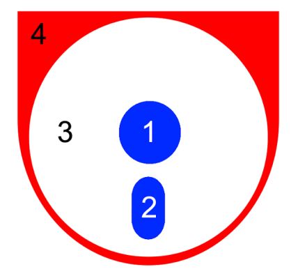
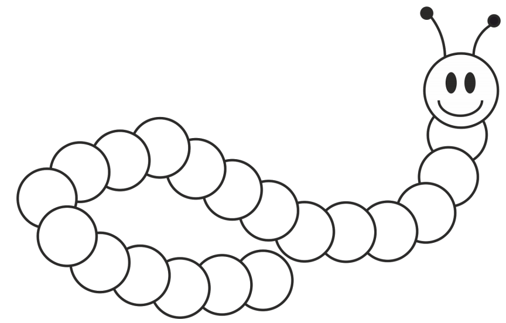
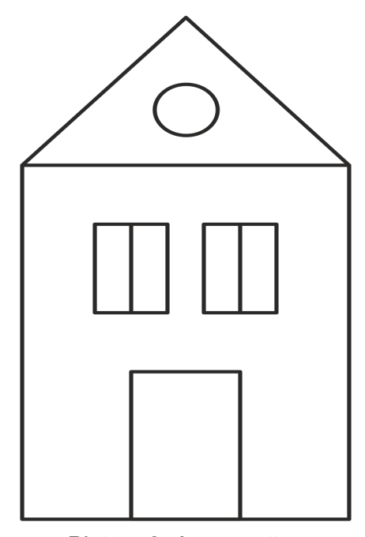
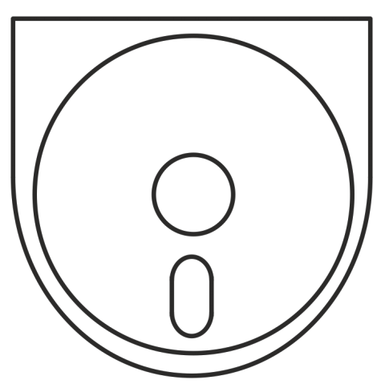
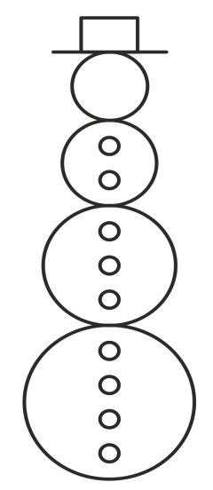
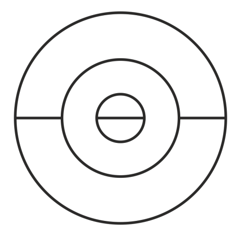
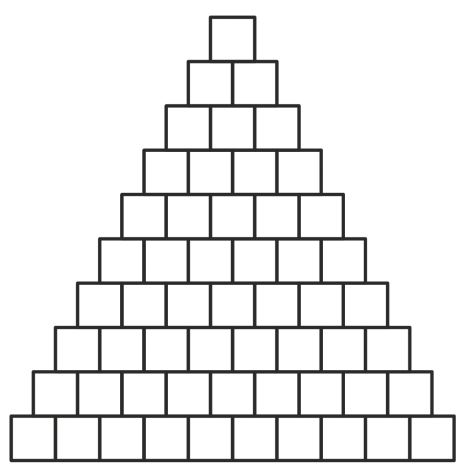
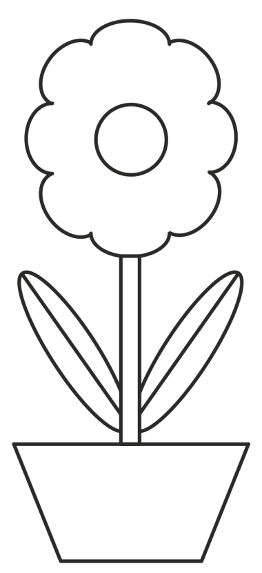
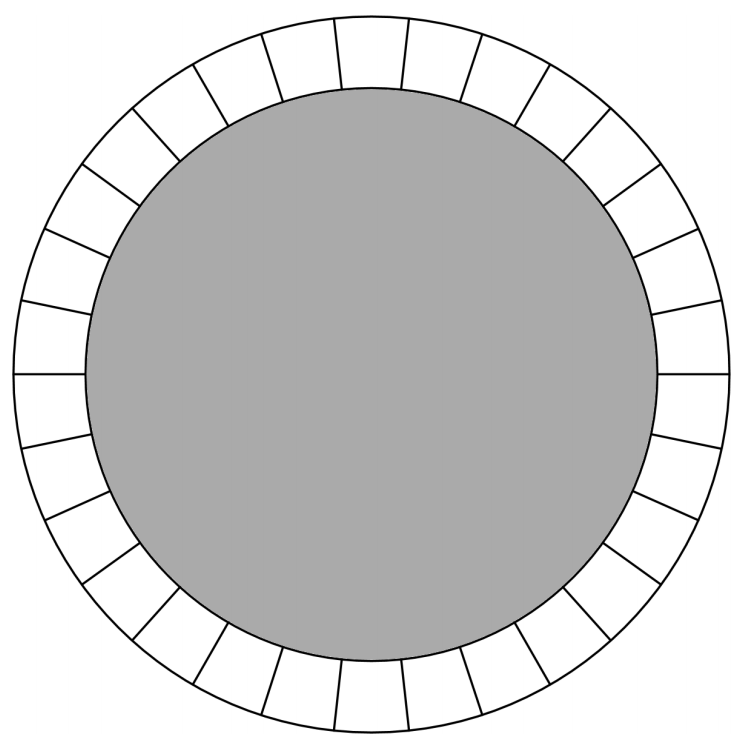

## 문제

Young Bojan, today a successful student of electrical engineering, loved coloring ever since he was a little boy. Remembering careless days from his childhood, he decided to buy a coloring book and K colors and get to work. It’s interesting that Bojan doesn’t like colorful pictures, so he decided to color each picture using at most three different colors. Additionally, Bojan will never color two adjacent areas using the same color because, as he puts it, "what’s the use of this line in between then?" Two areas are considered adjacent if their edges have at least one joint point. For example, areas denoted with 4 and 3 (see image below) are adjacent, whereas areas 1 and 2 aren’t. Additionally, coloring of the image below is in accordance with all of Bojan’s demands.

Before he begins coloring a picture, Bojan asks himself in how many ways he can color that picture so he meets with all his conditions. Given the fact that Bojan is studying electrical engineering, it is understandable that combinatorics isn’t his strong point, so he asked you for help.

## 입력

The first and only line of input contains two integers N (1 ≤ N ≤ 8) and K (1 ≤ K ≤ 1 000) which denote the ordinal number of the picture from the coloring book and the number of different colors Bojan can use, respectively.

You can find the coloring book with the numbered pictures on the next page.

## 출력

The first and only line of output must contain the number of ways Bojan can color the Nth picture from the coloring book if he has K different colors at his disposal. Two colorings are different if they differ in color in at least one area.

## 힌트

## HAPPY COLORING BOOK

Picture 1. Caterpillar (the eyes and the antennas are not areas and should not be colored)

Picture 2. A sea cottage

Picture 3. A well known logo

Picture 4. Frosty the Snowman

Picture 5. An abstract ball

Picture 6. Pyramid

Picture 7. Daisy

Picture 8. Trampoline (the gray part is not considered an area and should not be colored)
