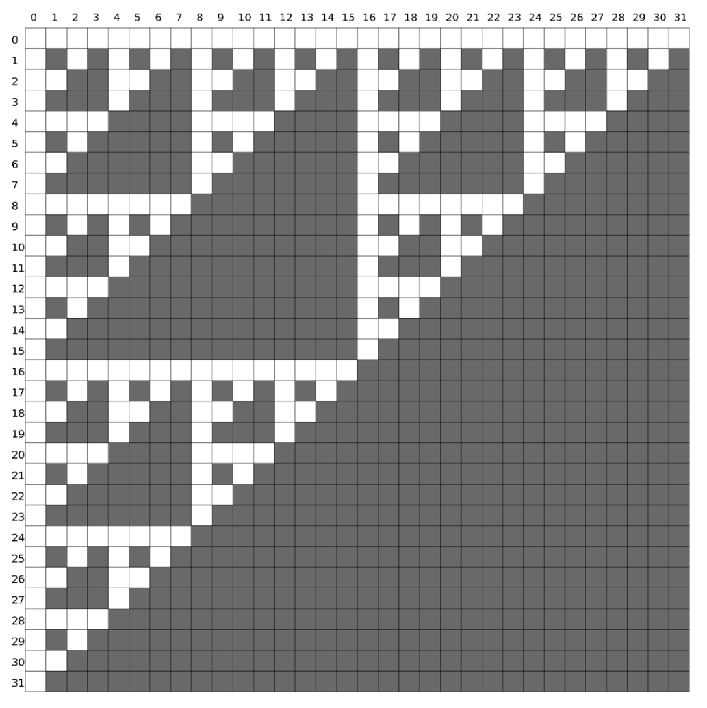

## 문제

A group of Czech tourists is walking in a labyrinth of a strange self-similar shape. The ground plan of the labyrinth is a Sierpinski triangle – a fractal structure named after the Polish mathematician Wacław Sierpiński.

The labyrinth consists of a billion rows numbered from 0 to 109−1 from top to bottom, and a billion columns numbered from 0 to 109 − 1 from left to right. The fields in the labyrinth can be either free or blocked.

The field in row X and column Y is free if the result of the bitwise ‘and’ operation on the numbers X and Y is equal to zero, otherwise it is blocked. In other words, a field is blocked if, when X and Y are switched to binary, there is an integer k such that the kth digit from the right of the number X and the kth digit from the right of the number Y are equal to 1.

The first 32 rows and columns of the labyrinth. The blocked fields are colored in black.

The Czech tourists are tired from a long day of wandering and would like to meet up in a free field and exchange experiences. In each step, one tourist can jump to one of the adjacent free fields (up, down, left or right).

Write a programme that will, based on the current tourists’ locations, determine minimum total number of steps necessary in order for all the tourists to meet in the same field.

## 입력

The first line of input contains an integer N – the number of tourists. Each of the following N lines contains two integers Ri and Si – the row and column of the field where the ith tourist is located.

All the tourists are located in free fields, and it is possible that there are multiple tourists in the same field.

## 출력

The first and only line of output must contain the required minimum number of steps.

Please note: We recommend that you use a 64-bit integer data type (int64 in Pascal, long long in C/C++).

## 힌트

Clarification of the first example: One of the fields where the brave Czech tourists could have met is (2, 0).

Clarification of the second example: One of the fields where the playful Czech tourists could have met is (8, 4).
