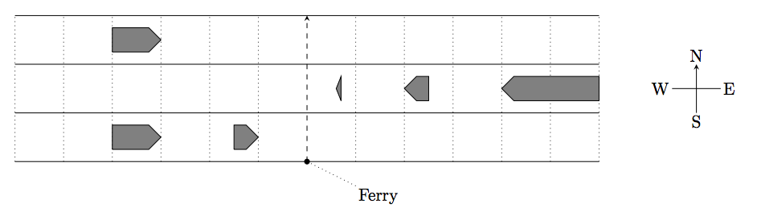

## 문제

Ferries crossing the Strait of Gibraltar from Morocco to Spain must carefully navigate to avoid the heavy ship traffic along the strait. Write a program to help ferry captains find the largest gaps in strait traffic for a safe crossing.

Your program will use a simple model as follows. The strait has several parallel shipping lanes in eastwest direction. Ships run with the same constant speed either eastbound or westbound. All ships in the same lane run in the same direction. Satellite data provides the positions of the ships in each lane. The ships may have different lengths. Ships do not change lanes and do not change speed for the crossing ferry.

The ferry waits for an appropriate time when there is an adequate gap in the ship traffic. It then crosses the strait heading northbound along a north-south line at a constant speed. From the moment a ferry enters a lane until the moment it leaves the lane, no ship in that lane may touch the crossing line. Ferries are so small you can neglect their size. Figure I.1 illustrates the lanes and ships for Sample Input 1. Your task is to find the largest time interval within which the ferry can safely cross the strait.

Figure I.1: Sample Input 1.

## 입력

The first line of input contains six integers: the number of lanes n (1 ≤ n ≤ 105), the width w of each lane (1 ≤ w ≤ 1 000), the speed u of ships and the speed v of the ferry (1 ≤ u, v ≤ 100), the ferry’s earliest start time t1 and the ferry’s latest start time t2 (0 ≤ t1 < t2 ≤ 106). All lengths are given in meters, all speeds are given in meters/second, and all times are given in seconds.

Each of the next n lines contains the data for one lane. Each line starts with either E or W, where E indicates that ships in this lane are eastbound and W indicates that ships in this lane are westbound. Next in the line is an integer mi, the number of ships in this lane (0 ≤ mi ≤ 105 for each 1 ≤ i ≤ n). It is followed by mi pairs of integers lij and pij (1 ≤ lij ≤ 1 000 and −106 ≤ pij ≤ 106). The length of ship j in lane i is lij , and pij is the position at time 0 of its forward end, that is, its front in the direction it moves.

Ship positions within each lane are relative to the ferry’s crossing line. Negative positions are west of the crossing line and positive positions are east of it. Ships do not overlap or touch, and are sorted in increasing order of their positions. Lanes are ordered by increasing distance from the ferry’s starting point, which is just south of the first lane. There is no space between lanes. The total number of ships is at least 1 and at most 105.

## 출력

Display the maximal value d for which there is a time s such that the ferry can start a crossing at any time t with s ≤ t ≤ s + d. Additionally the crossing must not start before time t1 and must start no later than time t2. The output must have an absolute or relative error of at most 10−3. You may assume that there is a time interval with d > 0.1 seconds for the ferry to cross.
