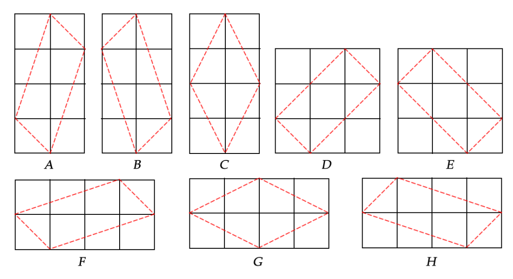

## 문제

Youssef is a Moroccan tile installer who specializes in mosaics like the one shown on the right. He has rectangular tiles of many dimensions at his disposal, and the dimensions of all his tiles are integer numbers of centimeters. When Youssef needs parallelogram-shaped tiles, he cuts them from his supply on hand. To make this work easier, he invented a tile cutting machine that superimposes a centimeter grid on the cutting surface to guide the cuts on the tiles. Due to machine limitations, aesthetic sensibilities, and Youssef’s dislike of wasted tiles, the following rules determine the possible cuts.

The rectangular tile to be cut must be positioned in the bottom left corner of the cutting surface and the edges must be aligned with the grid lines.  
The cutting blade can cut along any line connecting two different grid points on the tile boundary as long as the points are on adjacent boundary edges.  
The four corners of the resulting parallelogram tile must lie on the four sides of the original rectangular tile.  
No edge of the parallelogram tile can lie along an edge of the rectangular tile.

Figure J.1 shows the eight different ways in which a parallelogram tile of area 4 square centimeters can be cut out of a rectangular tile, subject to these restrictions.

Figure J.1: The eight different ways for cutting a parallelogram of area 4.

Youssef needs to cut tiles of every area between alo and ahi. Now he wonders, for which area a in this range can he cut the maximum number of different tiles?

## 입력

The input consists of multiple test cases. The first line of input contains an integer n (1 ≤ n ≤ 500), the number of test cases. The next n lines each contain two integers alo, ahi (1 ≤ alo ≤ ahi ≤ 500 000), the range of areas of the tiles.

## 출력

For each test case alo, ahi, display the value a between alo and ahi such that the number of possible ways to cut a parallelogram of area a is maximized as well as the number of different ways w in which such a parallelogram can be cut. If there are multiple possible values of a display the smallest one.
