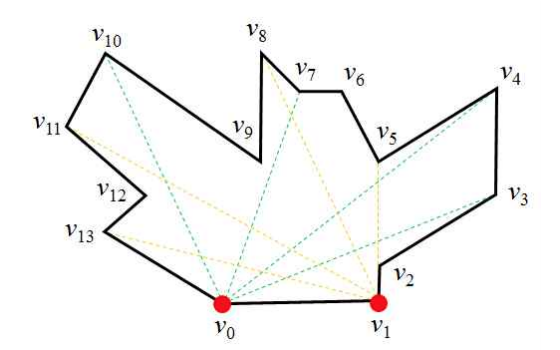

## 문제

K 미술관은 많은 벽으로 구성된 특이한 구조를 가진 건축물로 유명하다. 미술관의 내부 조명을 위해서 두 개의 전등이 한 쪽 벽의 양 끝 모서리에 설치되어 있는데, 건물의 내부에 조명이 미치지 않는 곳이 없다. 즉, 건물 내부의 모든 장소는 적어도 하나의 전등으로부터 조명을 받을 수 있다.

정보올림피아드를 준비하는 홍길동은 이 미술관 건물을 좋아해서 시간이 날 때마다 관람하러 온다. 하루는 미술관을 관람하던 중에 갑자기 “미술관 내부의 두 지점을 연결하는 최단 경로는 어떤 모양일까?”라는 의문점이 떠올랐다. 일반적인 다각형에서 최단 경로 알고리즘을 구현하는데 힘들었던 기억을 되살리면서, 두 개의 전등으로 모든 곳을 비출 수 있는 미술관의 특이한 구조 때문에 최단 경로를 쉽게 구할 수 있지 않을까라는 생각을 하게 되었다.

미술관을 n개의 정점을 가진 다각형 P = (v0, v1, ..., vn-1)로 나타낼 수 있다. 정점 리스트는 다각형의 경계선을 반시계방향으로 따라가면서 정점들을 순서대로 나열한 것이다. 미술관에서 전등이 설치된 장소를 정점 v0과 v1이라고 하자. 에지 (v0, v1)은 수평 선분으로 v0의 x-좌표는 항상 v1의 x-좌표보다 작다. v0과 v1을 제외한 나머지 모든 정점의 y-좌표는 v0의 y-좌표보다 크다(그림 1 참조).

미술관 내부의 어떤 장소 q가 전등 v의 조명을 받는다는 것은, 두 점 q와 v를 연결하는 선분이 P의 외부와 만나지 않는다는 것을 말한다. P의 모든 점은 v0 또는 v1로부터 조명을 받는다는 사실에 유의하라.

그림 1. 다각형의 모든 점이 v0 또는 v1로부터 조명을 받는다.

그림 1의 다각형에서 정점 v8과 v11은 v1로부터만 조명을 받고, v3과 v4는 v0으로부터만 조명을 받는다. 나머지 정점들은 v0과 v1 둘 다로부터 조명을 받는다. 두 정점 사이의 최단 경로가 항상 다각형의 정점에서만 꺾인다는 것은 잘 알려져 있다. 예를 들어, 두 정점 v4와 v11 사이의 최단 경로는 (v4, v5, v9, v11)이다. 두 정점 v5와 v1 사이의 최단 경로는 하나의 선분인 (v5, v1)이다.

홍길동을 도와서 다각형 P의 두 정점이 주어질 때, 두 정점 사이의 최단 경로를 구하는 프로그램을 작성하시오.

## 입력

첫째 줄에 다각형 P의 정점의 개수를 나타내는 정수 n이 주어진다. n은 3 이상 100,000 이하이다. 둘째 줄부터 n개의 줄에는 v0으로부터 시작하여 각 줄마다 하나씩 P의 각 정점 vi의 좌표를 나타내는 두 개의 정수가 주어진다 (i = 0, 1, ..., n-1). 각 좌표는 -109 이상 109 이하이다. P의 모든 점은 v0 또는 v1로부터 조명을 받고, v0과 v1의 y-좌표는 같으며, v0은 v1보다 x-좌표가 작다. v0과 v1을 제외한 나머지 모든 정점은 v0보다 y-좌표가 크다. P의 경계선을 따라서 연속된 어떤 세 정점도 일직선 상에 위치하지 않는다. 마지막 줄에는 최단 경로를 구하려고 하는 두 정점 vi와 vj를 나타내는 정점 번호인 정수 i와 j가 주어진다 (i≠j). 여기서 vi는 출발점이고 vj는 도착점이다.

## 출력

입력으로 주어진 두 정점 vi와 vj를 연결하는 최단 경로를 (w0, w1, ..., wm-1)이라고 하자. 여기서 w0 = vi, wm-1 = vj이고, wk (1 ≤ k ≤ m-2)는 최단 경로 상의 꺾인 점이다. 첫째 줄에 m을 출력하고, 둘째 줄에 wk에 해당하는 P의 정점 번호를 순서대로 출력한다 (0 ≤ k ≤ m-1).

## 힌트

예제 1은 문제의 그림이고, 예제 2는 모든 점이 v0으로부터 조명을 받는 예
