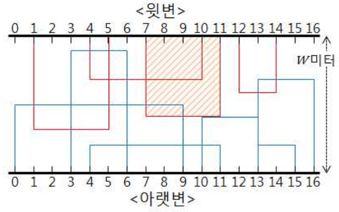

## 문제

KOI 매트 회사에서는 세로 폭이 W미터이고 가로로 긴 형태의 매트 원판을 제작하였다. 이 원판은 너무 커서 그대로 팔지는 못하고, 작은 조각으로 재단해서 판다. 이 회사에서 보유하고 있는 재단 기계는 구형이어서 다음 제약 사항을 가진다.

1. 변의 길이가 정수인 직사각형 조각으로만 재단이 가능하다.
2. 원판의 가로 변에 평행 또는 수직 방향으로만 자를 수 있다.
3. 재단된 조각은 원판의 윗변이나 아랫변 중 하나에 반드시 닿아 있다. (양변 모두에 닿아 있는 것도 가능하다.)
4. 원판의 가로 변에는 1미터마다 눈금이 매겨져 있는데, 세로 방향으로는 정수 미터의 위치에서만 자를 수 있다.

이 매트 원판에는 아이들이 좋아하는 캐릭터들이 그려져 있는데, 캐릭터마다 선호도가 달라 각 조각을 팔아 얻을 수 있는 이익이 다르다. 매트 회사에서는 시장조사를 통해 어느 부분을 재단해서 팔았을 때 얼마의 이익을 얻을 수 있는 지 미리 파악하였다. 위 그림은 상품화가 가능한 (즉, 이익을 얻을 수 있는) 조각의 모양을 표시한 예이다. (그림에서 아랫변에 닿아있는 조각은 파란색으로, 윗변에 닿아 있는 조각은 붉은 색으로 표시하였다.)

회사에서는 재단된 조각들을 팔아 얻을 수 있는 이익의 합이 최대가 되도록 이 원판을 재단하고자 한다. 직사각형 모양의 매트만 상품화가 가능하기 때문에 조각들의 면이 서로 겹치지 않게 재단해야한다. (단, 변만 겹치는 경우는 허용된다.) 예를 들어 왼쪽 변이 눈금 7의 위치에 있는 붉은색 조각(그림에서 빗금 친 조각)을 잘라 상품으로 만드는 경우, 왼쪽 변이 눈금 4의 위치에 있는 붉은색 조각과 왼쪽 변이 눈금 0에서 시작하는 파란색 조각은 상품화가 불가능하다. 하지만, 왼쪽 변이 위치 10에 있는 파란색 조각의 경우, 변만 겹치므로 이 파란색 조각은 상품화가 가능하다.

상품화가 가능한 조각에 대한 위치 정보와 이익이 주어졌을 때, 원판을 재단하여 얻을 수 있는 최대 이익을 구하는 프로그램을 작성하시오.

## 입력

첫 번째 줄에는 상품화가 가능한 매트 조각의 개수를 나타내는 정수 N(3 ≤ N ≤ 3,000)과 세로 폭의 너비를 나타내는 정수 W (1 ≤ W ≤ 108)가 주어진다. 다음 N 개의 각 줄에 조각의 정보를 나타내는 5개의 정수 P, L, R, H, K 가 주어진다. 여기서 P는 조각이 원판의 어느 변에 닿아 있는 지 나타내는데, 윗변에 닿아 있으면 0이고 아랫변에 닿아 있으면 1이다. 양변 모두에 닿아있는 경우, 0 과 1 중 하나가 임의로 주어진다. L 과 R (0 ≤ L < R ≤108)은 조각의 왼쪽 변과 오른쪽 변의 위치를 나타내고, H (1 ≤ H ≤ W)는 조각의 세로변의 길이를 나타내고, K(1 ≤ K ≤ 10,000)는 조각을 팔아 얻게되는 이익을 나타낸다.

## 출력

매트 원단을 재단하여 얻을 수 있는 이익의 최댓값을 나타내는 정수를 출력한다.
