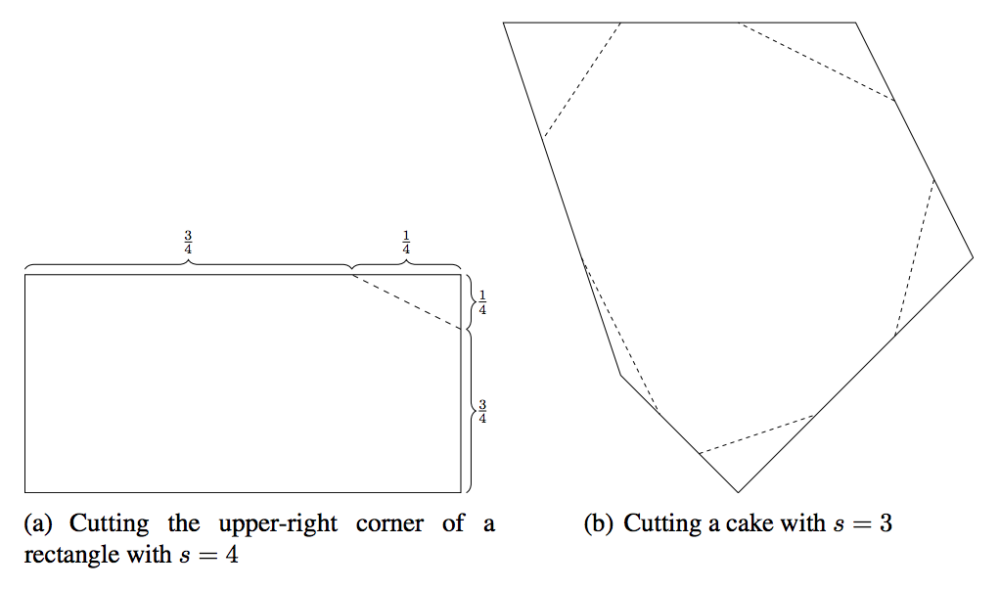

## 문제

Sophie loves to bake cakes and share them with friends. For the wedding of her best friend Bea she made a very special cake using only the best ingredients she could get and added a picture of the engaged couple on top of the cake. To make it even more special she did not make it round or square, but made a custom convex shape for the cake. Sophie decided to send the cake by a specialized carrier to the party. Unfortunately, the cake is a little too heavy for their default cake package and the overweight fees are excessive. Therefore, Sophie decides to remove some parts of the cake to make it a little lighter.

Sophie wants to cut the cake the following way: First, she chooses a real number s ≥ 2. For each vertex and each incident edge of the cake she marks where 1/s of the edge’s length is. Afterwards, she makes a direct cut between the two markings for each vertex and removes the vertex that way.

Figure C.1: Illustration of the first two Sample Inputs.

Sophie does not want to cut more from the cake than necessary for obvious reasons. Can you tell her how to choose s?

## 입력

The first line contains a floating point number a and an integer N, where a denotes the ratio of the cake’s weight allowed by the carrier and N the number of vertices of the cake (0.25 ≤ a < 1; 3 ≤ N ≤ 100). a will be specified with at most 7 digits after the decimal point.

Then follow N lines, each describing one of the cake’s vertices with two integers xi and yi, the coordinates of the vertex (0 ≤ xi, yi ≤ 108 for all 1 ≤ i ≤ N). The vertices are given in the order in which they form a strictly convex shape.

You may safely assume that the weight is uniformly distributed over the area of the cake. Furthermore, it will always be possible to cut the cake with some 2 ≤ s ≤ 1000 such that the proportion of the remaining cake is a of the original weight.

## 출력

Print a line containing s, the biggest value as specified above such that the remaining cake’s weight is at most the proportion a of its original weight.

Your answer will be considered correct if the absolute error is at most 10−4.
