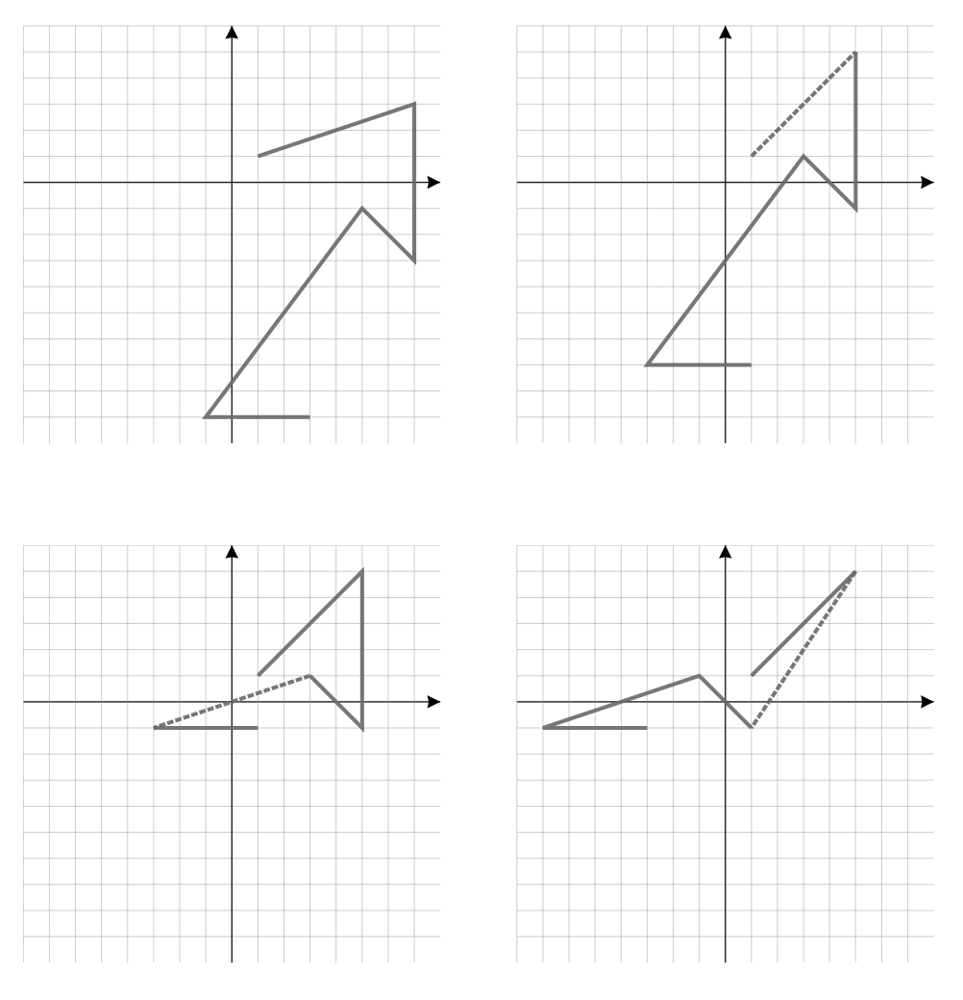

## 문제

Stjepan is programming a robot arm that can use a chalk to draw on a blackboard located in a standard coordinate plane (x coordinate increases to the right, y coordinate increases upwards).

The robot arm’s plan is an array of precisely N vectors (x1, y1), . . . , (xN, yN) where each xi and yi are even integers. The plan is executed by the robot arm starting from point (1, 1) and making N steps: in the i th step, the arm moves the chalk from the current point (x, y) straight to the point (x + xi, y + yi). Therefore, the robot arm is drawing a kind of a broken line in the coordinate plane, and the segments of that broken line are the given vectors.

While Stjepan is devising and changing his plan, sometimes he wants to know how many times the chalk will go over the coordinate axes. Write a programme that will simulate the process of changing the plan and that will give answers to Stjepan’s queries.

The layout of the plan on each ‘Q‘ command in the second test case. The dotted line marks the segment that was most recently changed.

Let us assume that Stjepan wrote down his plan in a text file that consists of N lines – the ith line contains the vector (xi, yi). Initially, Stjepan’s cursor is located at the first line of the file. Your programme should simulate the following commands:

* ‘B‘ – the cursor moves to the previous line (if it’s already located at the first line, nothing happens).
* ‘F‘ – the cursor moves to the next line (if it’s already located at the last line, nothing happens).
* ‘C nx ny‘ – where nx and ny are even integers. The row of the file where the cursor is located at changes in a way that the current vector is replaced with the vector (nx, ny).
* ‘Q‘ – you need to output how many times the dotted line which is described by the current plan went over the coordinate axes. If the dotted line goes through the starting point, then we count that as two times going over the coordinate axes.

## 입력

The first line of input contains the integer N – the number of vectors in the plan. The ith of the following N lines contains two even integers xi and yi separated by a single space – the coordinates of the ith vector in the initial plan.

The following line contains the integer M – the number of commands which execution you need to simulate. Each of the following M lines contains a single command. A command is either one of the uppercase letters ‘B’, ‘F’ or ‘Q’ or an expression in the form ‘C nx ny’ where nx and ny are even integers described in the task.

## 출력

For each ‘Q‘ command from the input, you must output its result in a single line. The results need to be printed in the order which the commands appear in the input.
