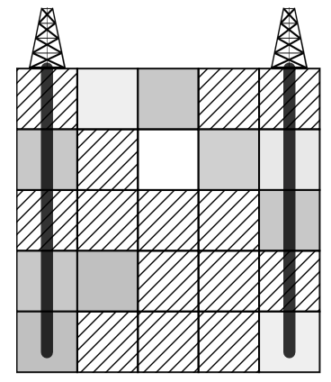

## 문제

The intersection of an oil field is of rectangular shape and consists of fields organized in R rows and S columns. The fields that contain oil are denoted with digits from 0 to 9 that also denote the amount of oil that can be drilled from the field, whereas the leftover fields are denoted with the character ’.’.

The oil drill is built in a way that we first choose the column, build a tower in that column (above ground) and drill straight down through the whole column going through possibly one or more layers of oil.

In the third sample test below, we can pump out all the oil using two drill holes.

After we have made the drill holes, the process of pumping the oil out begins. During this time, all the oil is pumped out from each pool (a set of connected fields of oil) which an oil drill goes through. In other words, the oil will be pumped out of each field that can be used to reach the field which an oil drill goes through, moving in each step up, down, left or right so that we walk on only the fields denoted with digits.

Write a programme that will, for the given oil field and each integer K ≤ S determine the maximum possible total amount of oil that can be pumped out by making at most K oil drills.

## 입력

The first line of input contains integers R, S – respectively, the number of rows and columns of the intersection.

Each of the following R lines contains an array of S characters ‘.’ or ‘0’-’9’ that describe one row of the intersection.

## 출력

The output must contain S integers, each in its own line, where the Kth integer denotes the maximum possible amount of oil that can be pumped out if we can make at most K oil drills.
