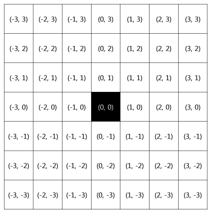
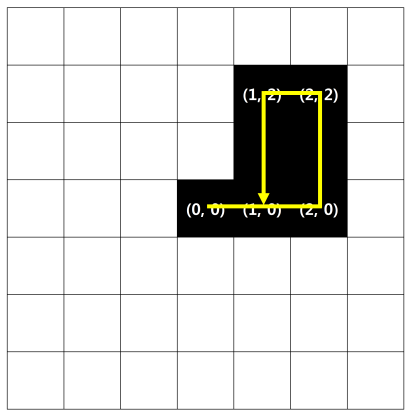

## 문제

가로 길이와 세로 길이가 모두 2L + 1인 2차원 격자판이 있다. 이 격자판의 각 칸을 그 좌표에 따라 (x, y)로 표현하기로 한다. 격자판의 가운데 칸의 좌표는 (0, 0)이고, 맨 왼쪽 맨 아래 칸의 좌표는 (−L, −L), 그리고 맨 오른쪽 맨 위 칸의 좌표는 (L, L)이다. x좌표는 왼쪽에서 오른쪽으로 갈수록, y좌표는 아래에서 위로 갈수록 증가한다.

이 격자판의 (0, 0) 칸에 한 마리의 뱀이 자리를 잡고 있다. 처음에는 뱀의 크기가 격자판의 한 칸의 크기와 같으며, 뱀의 머리는 격자판의 오른쪽을 바라보고 있다. 이 뱀은 자신이 바라보고 있는 방향으로 1초에 한 칸씩 몸을 늘려나가며, 뱀의 머리는 그 방향의 칸으로 옮겨가게 된다. 예를 들어 위의 그림과 같이 L = 3인 경우를 생각해 보자. 뱀은 처음에 (0, 0)에 있으며, 그 크기는 격자판 한 칸 만큼이고, 뱀의 머리가 바라보고 있는 방향은 오른쪽이다. 1초가 지나고 나면 이 뱀은 몸을 한 칸 늘려서 (0, 0)과 (1, 0)의 두 칸을 차지하게 되며, 이때 (1, 0) 칸에 뱀의 머리가 놓이게 된다. 1초가 더 지나고 나면 (0, 0), (1, 0), (2, 0)의 세 칸을 차지하게 되고, 뱀의 머리는 (2, 0)에 놓이게 된다.

이 뱀은 자신의 머리가 향하고 있는 방향을 일정한 규칙에 따라 시계방향, 혹은 반시계방향으로 90도 회전한다. 1번째 회전은 뱀이 출발한지 t1 초 후에 일어나며 i(i > 1)번째 회전은 i − 1번째 회전이 끝난 뒤 ti 초 후에 일어난다. 단, 뱀은 ti 칸 만큼 몸을 늘린 후에 머리를 회전하며 머리를 회전하는 데에는 시간이 소요되지 않는다고 가정한다.

만일 뱀의 머리가 격자판 밖으로 나가게 되면, 혹은 뱀의 머리가 자신의 몸에 부딪히게 되면 이 뱀은 그 즉시 숨을 거두며 뱀은 숨을 거두기 직전까지 몸을 계속 늘려나간다.

뱀이 머리를 회전하는 규칙, 즉 ti 와 그 방향에 대한 정보가 주어졌을 때, 뱀이 출발한지 몇 초 뒤에 숨을 거두는지를 알아내는 프로그램을 작성하라.

## 입력

첫 번째 줄에 정수 L(1 ≤ L ≤ 108)이 주어진다. 두 번째 줄에는 머리의 방향을 몇 번 회전할 것인지를 나타내는 정수 N(0 ≤ N ≤ 103)이 주어진다. 다음 N 개의 줄에 뱀이 머리를 어떻게 회전하는지에 대한 정보가 주어진다. i(1 ≤ i ≤ N)번째 줄에 정수 ti(1 ≤ ti ≤ 2 · 108)와 diri 가 차례로 주어지며 diri 는 문자 L, 또는 R 중 하나이다. 뱀은 i = 1인 경우 출발, 그 외의 경우엔 i − 1번째 회전으로부터 ti 초 후에 diri 의 방향으로 머리를 회전하며, 만일 diri 가 L 이라면 왼쪽 (반시계방향)으로, R 이라면 오른쪽 (시계방향)으로 90도 회전한다.

## 출력

첫 번째 줄에 답을 나타내는 값을 하나 출력한다. 이 값은 뱀이 출발한지 몇 초 후에 숨을 거두는지를 나타낸다.

## 힌트

첫 번째 예제의 경우 출발 후 7초가 지나고 나면 뱀의 머리가 자신의 몸 (1, 0)에 부딪히게 되고, 이때 뱀은 숨을 거둔다.

