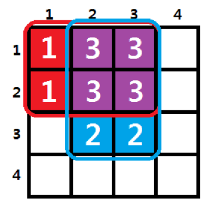

## 문제

새로운 도시를 지으려고 한다. 도시는 위에서 내려다 봤을 때 평면으로 나타낼 수 있는데, 도시의 구획을 109×109개의 균등한 크기의 칸으로 나누어 가장 왼쪽 위에 있는 칸을 (1,1), 가장 오른쪽 아래에 있는 칸을 (109,109)이라고 하자. 모든 칸에는 그 칸의 영향력을 나타내기 위해 숫자를 매길 것이다. 이 숫자들은 처음에 모두 0 으로 초기화되어 있다.

도시에는 여러 가지 편의 시설이 들어서므로, 도시를 짓기 전에 편의시설들이 주변에 미치게 되는 영향을 예상해 보았다. 각 예상은 다음과 같은 형태이다.

* a ≤ x ≤ c, b ≤ y ≤ d를 만족하는 칸 (x,y)에 p를 더한다.

그리고 최종적으로 각 칸들이 미치는 영향력의 크기는 각 칸에 써진 숫자의 제곱이 되며, 이 도시의 영향력은 모든 칸의 영향력을 더한 값이 된다.

예를 들어 다음과 같은 두 가지 예상이 있다고 해보자.

* 1 ≤ x ≤ 2,1 ≤ y ≤ 3을 만족하는 칸 (x,y)에 1을 더한다.
* 1 ≤ x ≤ 3,2 ≤ y ≤ 3을 만족하는 칸 (x,y)에 2을 더한다.

그러면 칸에 있는 숫자들은 다음과 같이 될 것이며, 도시의 총 영향력은 12×2+32×4+22×2=46이 된다.

N개의 예상이 주어지면, 모든 예상을 적용 하였을 때 도시의 영향력을 구하는 프로그램을 작성하라.

## 입력

첫 번째 줄에는 예상의 개수 N (1 ≤ N ≤ 105)가 주어진다.

다음 N개의 줄에는 각 줄마다 a,b,c,d,p (1 ≤ a ≤ c ≤ 109, 1 ≤ b ≤ d ≤ 109, 1 ≤ p ≤ 100)가 공백으로 구분되어 주어진다. 이는 위에서 설명한 하나의 예상을 의미한다.

## 출력

주어진 예상을 모두 적용하였을 때 도시의 영향력을 출력한다. 답이 매우 커질 수 있으므로 답을 1,000,000,007로 나눈 나머지를 출력한다.
