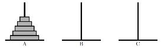

## 문제

기존 하노이는 모든 학생이 알 것이라 판단하여 설명을 생략한다.

우리는 하노이의 이동을 알파벳 두 글자로 표현할 수 있는데, 예를 들어 A번 폴에서 B번 폴로 가장 위에 있는 디스크를 옮기는 것을 AB라고 표현한다고 한다. 변형 하노이는 문제 조건에 만족하도록 옮기는 것이다. 즉, 자기 임의적으로 디스크를 옮길 수 없다. 디스크를 옮기는 조건은 아래와 같다.

* 동일한 디스크를 연속으로 두 번 옮길 수 없다.
* 총 옮길 수 있는 경우는 6가지(AB, AC, BA, BC, CA, CB)이고 이 여섯 가지의 옮기는 경우의 우선순위가 주어진다. 즉, 1번 조건을 만족하는 옮길 수 있는 경우가 두 가지 이상 존재하면 그 중 우선순위가 높은 것을 택해야 한다.

문제는 위 조건에 따라 판을 옮길 때 모든 디스크를 B폴이나 C폴 중 한 폴로 모두 옮겼을 때 횟수가 몇 번인지 구하는 것이다. (위 조건을 만족하도록 옮기다 보면 항상 어느 폴로 모두 옮겨진다고 한다.)

## 입력

첫 줄에는 디스크의 수 N(1 ≤ N ≤ 30)과 주어진다. 두 번째 줄에는 6개의 이동 경우에 대해 우선순위가 높은 것부터 차례대로 주어진다.

## 출력

첫 줄에 이동횟수를 출력한다. 답은 10^18보다 작다고 가정한다.

## 힌트

1. 1번 디스크를 A->B로 옮긴다. 2. 2번 디스크를 A->C로 옮긴다. 3. 1번 디스크를 B->A로 옮긴다. 4. 2번 디스크를 C->B로 옮긴다. 5. 1번 디스크를 A->B로 옮기면 끝나게 된다.
