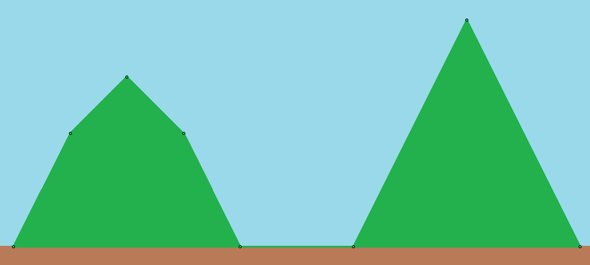
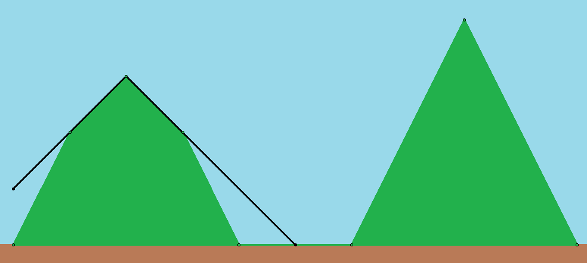
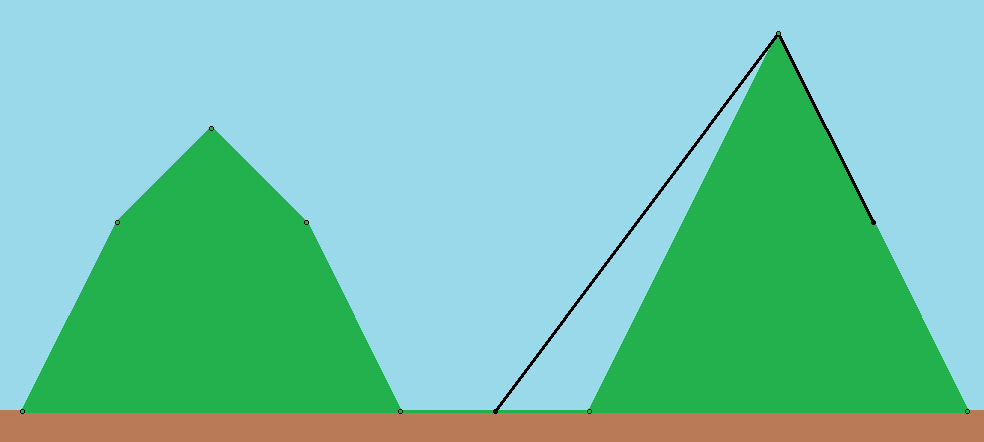

## 문제

2차원 평면 위에는 까마귀가 한 마리 살고 있다. 까마귀는 오늘 하루도 먹이를 찾기 위해, 반짝이는 것을 찾기 위해 많이 돌아다녔다.

평면 상에서 y < 0인 부분은 땅이기 때문에 까마귀가 갈 수 없는 곳이다. 또한 하나의 산이 있어서 산의 안쪽에도 까마귀는 갈 수 없다. 산은 P1(x1, y1)에서 PN(xN, yN)까지의 N개의 정점으로 나타낼 수 있다. xi는 증가하는 순서이고, yi ≥ 0이며 y1 = yn = 0이다. P1에서 PN까지를 순서대로 연결하고, PN과 P1을 연결한 다각형이 산이 된다. 까마귀는 산의 변 위로는 올라갈 수 있지만, 내부로는 들어갈 수 없다.

까마귀는 오늘 하루 M-1번 이동했다. 처음에는 Q1(X1, Y1)에 위치해 있었으며, 다음으로는 Q2(X2, Y2), …, 마지막으로 QM(XM,YM)를 방문하여 하루를 끝냈다. 까마귀는 똑똑하기 때문에 Qi에서 Qi+1로 이동할 때 땅의 내부나 산의 내부로 이동하지 않으면서 거리가 가장 짧은 경로로 이동하였다. 오늘 하루 까마귀가 이동한 거리는 얼마인지 구하는 프로그램을 작성하라.

## 입력

입력의 첫 번째 줄에는 N(3 ≤ N ≤ 105)이 주어진다.

다음 N개의 줄의 i번째 줄에는 xi, yi (-108 ≤ xi ≤ 108, 0 ≤ yi ≤ 108)가 공백 하나로 구분되어 주어진다. xi < xi+1 (1 ≤ i < N)와 y1 = yN = 0을 만족한다.

다음 줄에는 M(2 ≤ M ≤ 105)이 주어진다.

다음 M개의 줄의 i번째 줄에는 Xi, Yi(-108 ≤ Xi ≤ 108, 0 ≤ Yi ≤ 108)가 공백 하나로 구분되어 주어진다. (Xi, Yi)가 산 아래에 위치해 있는 경우는 없다.

## 출력

까마귀가 이동한 총 이동거리를 출력한다. 절대/상대 오차가 10-6이하인 경우 정답으로 인정된다.

## 힌트

예제 입력은 위의 그림과 같다. 초록색 부분은 산이고 갈색 부분은 땅이다. 까마귀는 하늘색 부분이나 산과 땅의 변을 통해 이동할 수 있다. 아래 그림은 까마귀의 두 이동을 나타낸다. 첫 번째 이동의 이동 거리는 5√2, 두 번째 이동의 이동 거리는 5+√5로 이를 모두 더하면 약 14.307135789365이다.

