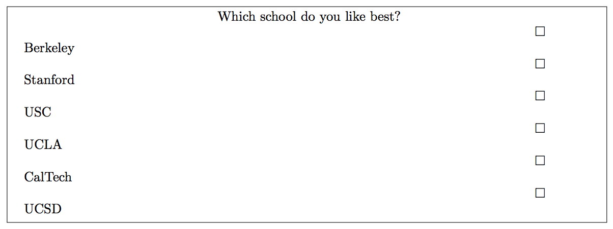

## 문제

In Spring of 2006, it was time for midterm elections, so the contest was titled the “Midterm Elections Contest”, and we explored some computational aspects thereof. One of the topics we looked at were the famous “butterfly ballots”. Butterfly ballots are a tried and true way to ensure that many voters will accidentally vote for the wrong candidate. In a butterfly ballot, all the candidates’ names are on one side (say, the left), while all the boxes in which to mark a vote are on the other side. Now, if the boxes are a little bit shifted, it can be hard to tell which box corresponds to which candidate. For instance, look at the following ballot:

You’ll have to admit that if one isn’t careful with this ballot, one might easily end up making a mark next to UCLA instead of USC. Of course, similar things could happen to political candidates.

You are to write a program to design a ballot that will make your candidate win, if possible. The assumption is that all candidates must be on the ballot, in some order from top to bottom that you can determine. The boxes will be on the other side, so that the first box is above the first candidate, the second box between the first and second candidate, and so forth. The assumption is then that among the voters who intend to vote for candidate i, half will actually vote for i, and half will accidentally vote for candidate i + 1. Of course, among the voters who intend to vote for the last candidate on the ballot, all will vote correctly. You are to decide if your candidate can be made to win the election. (If your candidate is tied for first place, we also consider that a win.)

## 입력

The first line contains a number K ≥ 1, which is the number of input data sets in the file. This is followed by K data sets of the following form:

The first line of the data set contains a number n with 1 ≤ n ≤ 100, the number of candidates on the ballot. Candidate 1 is the one you are trying to make win. This is followed by n lines, each containing a number 1 ≤ vi ≤ 1, 000, 000, the number of voters who intend to vote for candidate i. All the vi will be even numbers, so you don’t need to worry about what happens about division by 2.

## 출력

For each data set, first output “Data Set x:” on a line by itself, where x is its number. If it is possible for candidate 1 to win, then output “Possible” on a line by itself, otherwise output “Impossible”.

Each data set should be followed by a blank line.
