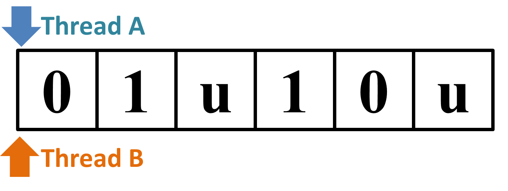
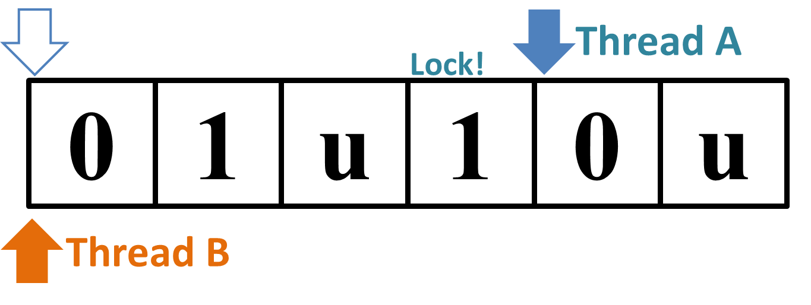

## 문제

In concurrent processing environments, a deadlock is an undesirable situation where two or more threads are mutually waiting for others to finish using some resources and cannot proceed further. Your task is to detect whether there is any possibility of deadlocks when multiple threads try to execute a given instruction sequence concurrently.

The instruction sequence consists of characters 'u' or digits from '0' to '9', and each of them represents one instruction. 10 threads are trying to execute the same single instruction sequence. Each thread starts its execution from the beginning of the sequence and continues in the given order, until all the instructions are executed.

There are 10 shared resources called locks from L0 to L9. A digit k is the instruction for acquiring the lock Lk. After one of the threads acquires a lock Lk, it is kept by the thread until it is released by the instruction 'u'. While a lock is kept, none of the threads, including one already acquired it, cannot newly acquire the same lock Lk.

Precisely speaking, the following steps are repeated until all threads finish.

1. One thread that has not finished yet is chosen arbitrarily.
2. The chosen thread tries to execute the next instruction that is not executed yet.
   * If the next instruction is a digit k and the lock Lk is not kept by any thread, the thread executes the instruction k and acquires Lk.
   * If the next instruction is a digit k and the lock Lk is already kept by some thread, the instruction k is not executed.
   * If the next instruction is 'u', the instruction is executed and all the locks currently kept by the thread are released.

After executing several steps, sometimes, it falls into the situation that the next instructions of all unfinished threads are for acquiring already kept locks. Once such a situation happens, no instruction will ever be executed no matter which thread is chosen. This situation is called a deadlock.

There are instruction sequences for which threads can never reach a deadlock regardless of the execution order. Such instruction sequences are called safe. Otherwise, in other words, if there exists one or more execution orders that lead to a deadlock, the execution sequence is called unsafe. Your task is to write a program that tells whether the given instruction sequence is safe or unsafe.

## 입력

The input consists of at most 50 datasets, each in the following format.

```

n
s
```

n is the length of the instruction sequence and s is a string representing the sequence. n is a positive integer not exceeding 10,000. Each character of s is either a digit ('0' to '9') or 'u', and s always ends with 'u'.

The end of the input is indicated by a line with a zero.

## 출력

For each dataset, if the given instruction sequence is safe, then print "SAFE" in a line. If it is unsafe, then print "UNSAFE" in a line.

## 힌트

The second input "01u10u" may possibly cause a deadlock. After one thread has executed the initial four instructions "01u1", the thread keeps only one lock L1. If another thread executes the first instruction '0' at this time, this thread acquires L0. Then, the first thread tries to acquire L0, already kept by the second thread, while the second thread tries to acquire L1, kept by the first thread; This leads to a deadlock.

 → 

Figure 1: Why the Sample Input 2 "01u10u" is unsafe.

Contrarily, the third input "201u210u" is safe. If one thread had executed up to "201u21" and another to "20", then one may think it would lead to a deadlock, but this can never happen because no two threads can simultaneously keep L2.
