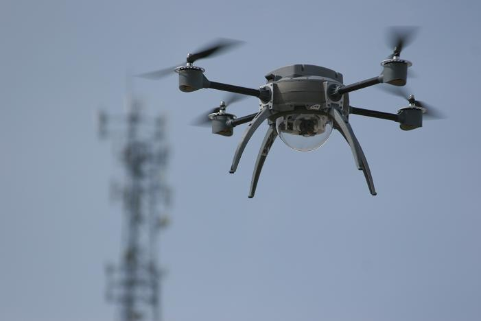

## 문제

You are developing small flying robots in your laboratory.

The laboratory is a box-shaped building with K levels, each numbered 1 through K from bottom to top. The floors of all levels are square-shaped with their edges precisely aligned east-west and north-south. Each floor is divided into R × R cells. We denote the cell on the z-th level in the x-th column from the west and the y-th row from the south as (x, y, z). (Here, x and y are one-based.) For each x, y, and z (z > 1), the cell (x, y, z) is located immediately above the cell (x, y, z − 1).

There are N robots flying in the laboratory, each numbered from 1 through N. Initially, the i-th robot is located at the cell (xi, yi, zi).

By your effort so far, you successfully implemented the feature to move each flying robot to any place that you planned. As the next step, you want to implement a new feature that gathers all the robots in some single cell with the lowest energy consumption, based on their current locations and the surrounding environment.

Floors of the level two and above have several holes. Holes are rectangular and their edges align with edges of the cells on the floors. There are M holes in the laboratory building, each numbered 1 through M. The j-th hole can be described by five integers u1j, v1j, u2j, v2j, and wj. The j-th hole extends over the cells (x, y, wj) where u1j ≤ x ≤ u2j and v1j ≤ y ≤ v2j.

Possible movements of robots and energy consumption involved are as follows.

* You can move a robot from one cell to an adjacent cell, toward one of north, south, east, or west. The robot consumes its energy by 1 for this move.
* If there is a hole to go through immediately above, you can move the robot upward by a single level. The robot consumes its energy by 100 for this move.

The robots never fall down even if there is a hole below. Note that you can move two or more robots to the same cell.

Now, you want to gather all the flying robots at a single cell in the K-th level where there is no hole on the floor, with the least energy consumption. Compute and output the minimum total energy required by the robots.

## 입력

The input consists of at most 32 datasets, each in the following format. Every value in the input is an integer.

```

N 
M K R 
x1 y1 z1 
... 
xN yN zN 
u11 v11 u21 v21 w1 
... 
u1M v1M u2M v2M wM
```

N is the number of robots in the laboratory (1 ≤ N ≤ 100). M is the number of holes (1 ≤ M ≤ 50), K is the number of levels (2 ≤ K ≤ 10), and R is the number of cells in one row and also one column on a single floor (3 ≤ R ≤ 1,000,000).

For each i, integers xi, yi, and zi represent the cell that the i-th robot initially located at (1 ≤ xi ≤ R, 1 ≤ yi ≤ R, 1 ≤ zi ≤ K). Further, for each j, integers u1j, v1j, u2j, v2j, and wj describe the position and the extent of the j-th hole (1 ≤ u1j ≤ u2j ≤ R, 1 ≤ v1j ≤ v2j ≤ R, 2 ≤ wj ≤ K).

The following are guaranteed.

* In each level higher than or equal to two, there exists at least one hole.
* In each level, there exists at least one cell not belonging to any holes.
* No two holes overlap. That is, each cell belongs to at most one hole.

Two or more robots can initially be located at the same cell. Also note that two neighboring cells may belong to different holes.

The end of the input is indicated by a line with a single zero.

## 출력

For each dataset, print the minimum total energy consumption in a single line.
