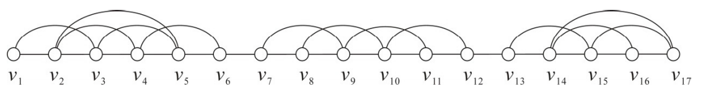
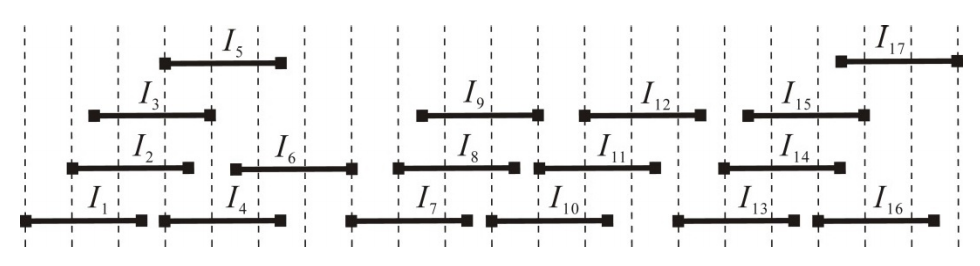

## 문제

An interval graph is the intersection graph of family F = {I1, I2, ..., In} of closed intervals on the real line, where two vertices, vi and vj, are connected with an edge if and only if their corresponding intervals, Ii and Ij, intersect. The family F is usually called an interval representation for the graph. A unit interval graph is an interval graph with an interval representation in which all the intervals have the same length. Refer to Figure 1 for an example of a unit interval graph and its interval representation.

(a) A unit interval graph G.

(b) An interval representation of the graph G.

Figure 1. A unit interval graph and its interval representation.

The closed neighbourhood N[vi] of a vertex vi of a graph G refers to the set of vertices adjacent to vi along with vi itself, i.e., N[vi] = {vi} ∪ {vj : (vj, vi) is an edge of G}. For the graph G shown in Figure 1(a), we have N[v1] = {v1, v2, v3} and N[v5] = {v2, v3, v4, v5, v6}. Under the ordering (v1, v2, ..., v17) of the vertices of G in which the position of vi, denoted by ρ(vi), is i for all vi, the closed neighbourhood N[vi] of every vertex vi is consecutive, i.e., the positions of vertices in N[vi] are integers which follow one after another, without gaps, from smallest to largest. An ordering of the vertices of a graph is said to be consecutive if the closed neighborhood of every vertex of the graph is consecutive. For the graph G of Figure 1(a), the ordering (v1, v2, ..., v15, v17, v16) with v16 and v17 being switched, where ρ(v17) = 16, ρ(v16) = 17, and ρ(vi) = i for all vi ≠ v16, v17, is also consecutive. However, (v2, v1, v3, v4, ..., v17) is not a consecutive ordering because the closed neighbourhood of v5 is not consecutive.

Given n closed intervals of the same length, I1, I2, ..., In, in a non-decreasing order of their left endpoints and an ordering (vi1, vi2, ..., vin) of the vertices of the unit interval graph defined on the n intervals, write a program to test whether the ordering is consecutive or not.

## 입력

Your program is to read from standard input. The input consists of T test cases. The number of test cases T is given in the first line of the input. Each test case begins with a line containing two positive integers n and l, where n ≤ 100,000 and l ≤ 100,000,000, respectively representing the number and the length of intervals. It follows n lines containing, one by one, the left endpoints of intervals, I1, I2, ..., In, in which the left endpoint of Ii is always less than or equal to that of Ij if i < j. You may assume that the endpoints, left or right, of intervals are between -100,000,000 and 100,000,000, inclusive. It follows n lines again, containing an ordering of the vertices of the unit interval graph defined on the n intervals, one vertex per line.

## 출력

Your program is to write to standard output. For each test case, print exactly one line that contains an integer indicating whether the given ordering is consecutive. If yes, the integer must be 1; otherwise -1.
