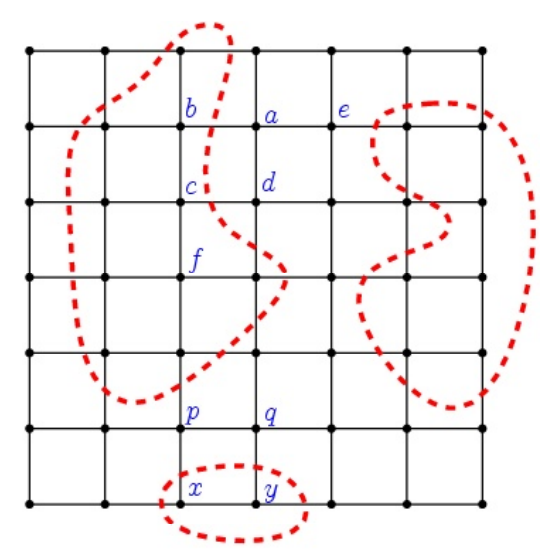

## 문제

In a planet all aliens {ai} live on points of N×N grid space. Some aliens like to live with the water and others do not. This tendency is called hydrophilic property. So each alien ai has its own degree of hydrophilic property as a real number hi where 0 ≤ hi ≤ 1. An alien not living in boundary edges or corners has 4 neighbors (up, down, right, left) in grid. An alien living in edge (corner) points has 3(2) neighbors. Let the friendship of two adjacent neighbor aliens ai and aj be determined by the hydrophilic property hi and hj as the following:

friend(ai,aj) = 1 - |hi - hj|

If two adjacent neighbour aliens have the same degree of hydrophilic property, then the friendship will be perfect such as friend(ai, aj) = 1. Critical situation, friend(ai, aj) = 0, may happen if hi = 0, hj = 1. Note that is not defined among non-adjacent alien pair such as (a,c) and (f,p) in Figure 1.

Those aliens decided to set up separating fences to reduce the conflicts between different hydrophilic aliens group. Thus they first need to allocate grid space to two disjoint regions; W region for hydrophilic aliens and Q region for hydrophobic aliens (who dislike the watery environment and have little values of hydrophilic property). So they will set up a closed fence for Q regions against W regions to separate conflicting aliens. In Figure 1, dotted cycles denote the separating fences for Q Aliens living on grid points {b,c,f,x,y} are classified as hydrophilic aliens. And {a,d,e,p,q} are aliens living in W region.

Figure 1. Three fences (dotted red) separate Q regions against R regions

There are so many ways to set up closed fences. When we build the separating fences, it is desirable to allocate the hydrophilic aliens to W region, and hydrophobic aliens to Q region. Also we should minimize the sum friend(ai, aj) for ai ∈ Q and aj ∈ W. Here x ∈ Q means that an alien x is assigned to Q region. All aliens are classified either Q or W exclusively.

So we give a formal objective function K for this (W, Q) separation problem as following:

K = maximize{ CostW + CostQ - CostWQ }, where

CostW = Σai∈Whi, CostQ = Σaj∈Q(1-hj),  
CostWQ = Σai∈W, aj∈Qfriend(ai,aj), where (ai,aj) is a grid edge.

You should write a program to compute K given the hydrophilic properties of aliens on grid points.

## 입력

Your program is to read from standard input. The input consists of T test cases. The number of test cases T is given in the first line of the input. Each test case starts with a line containing an integer N (3 ≤ N ≤ 50) denoting the grid size. In the following N lines, the real numbers denoting the hydrophilic property hi,j of the alien living on a grid position (i,j) are given as N×N matrix where 0 ≤ hi,j ≤ 1. The floating point hi,j has exactly two digits after decimal point.

## 출력

Your program is to write to standard output. Print exactly one line for each test case. The line should contain a real number K with two digits after decimal point.
