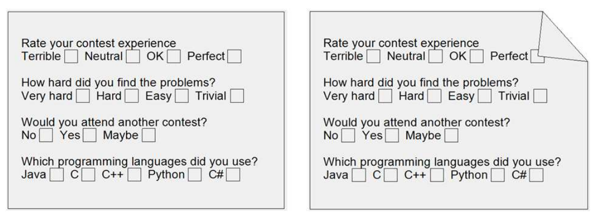

## 문제

Members of the Paperless University programming contest team were used to doing all their work digitally. Imagine their surprise at the end of a programming contest when the organisers asked them to fill in an evaluation form on paper!!! What were they to do? Of course they didn’t carry pens or pencils, and circumstances were such that borrowing was not an option. They did wish to submit evaluations. Fortunately, the evaluation form was multi-choice, so all they needed to do was to indicate their preferred option for each question. The team worked out a way of ‘filling’ in the form.

To answer a question they folded over one of the corners of the page to put it in the preferred answer square and creased the paper along the (straight) fold line. Choice of corner was arbitrary. After answering a question the paper was flattened again. The process was repeated for each answer they wished to ‘tick’. The result was a sheet of paper with one fold line for each answer the coder chose to provide.

Reading back the code was easy - make each fold and see where it pointed. Except ... the organisers of the programming contest were digital enthusiasts too. Their process was to scan and destroy all evaluation forms, then analyse the scans. Luckily the scanned forms showed shadows on the fold lines. The organisers wrote a program that allowed an operator to note the points at which fold lines intersected the edge of the paper.

Your task, given a list of fold line intersection points and information about the locations and sizes of question answer options, is to complete the decoding of the evaluation forms. Here is an example evaluation form. In the right image the top right corner has been folded over to provide the answer “Perfect” to the first question.

## 입력

The input contains a single test case.

The first line of input has four integers: W, H (100 ≤ W, H ≤ 1 000), Q (0 < Q ≤ 10) and F (0 < F ≤ 100): the width and height of the form in mm; the number of questions on the form; and the number of folds to decode, respectively.

This is followed by Q question descriptions. The first line of each question description has 5 integers, A, x, y, w and h, followed by the text of the question. A is is the number of answers to the question (0 < A ≤ 10). The four values x, y, w and h are the coordinates of the top left corner and the width and height of an enclosing rectangle for the question text (0 < x + w < W) and (0 < y + h < H).

The next A lines hold answer descriptions. Each has 8 integers x1, y1, w1 and h1 defining an enclosing rectangle for the answer text and x2, y2, w2 and h2 defining the rectangle that is the ‘tick’ box; followed by the text of the answer. (x1, y1) and (x2, y2) are the top-left corner of the respective rectangles and w1, w2, h1 and h2 are the widths and heights of the two rectangles. All rectangles will have positive area and will fit within the dimensions of the page. No rectangles can overlap each other but they may touch. All question and answer strings are non-empty.

After the text descriptions are F lines, each describing one fold in the form. The lines each hold 4 integers: x1, y1, x2, y2 being the x− and y−coordinates of the points at which a fold meets an edge of the paper. All input items are single space separated on their lines.

Fold lines are always between adjacent edges – they will not pass through a corner – and the corner between is the pointer. Each box will be ticked by at most one fold. The number of folds, F, will be less than or equal to the total number of answer boxes.

The coordinate system for the form is in millimetres; (0, 0) is the top left corner; (w, h) is the bottom right corner. Intersection points with an edge will have one coordinate that is exactly 0 (top or left), w (right) or h (bottom). The length of text in a question or answer is never more than 100 characters. You may assume all folds to be valid i.e.: they point into a tick box - and point cleanly inside the box (by at least 0.1mm).

## 출력

The output for each form should consist of one line per question. For each question the line should be the question text followed by a colon, a space and then a list of semicolon and space separated answers to that question. The answers should be listed in the order given in input. For some questions there may be no answer. For some questions there may be more than one answer.
