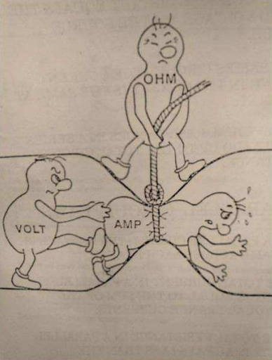

## 문제

You have been hired by Acme Circuit Manufacturers to help reduce the number of resistors used in their mass-produced electrical circuits, which will reduce manufacturing costs.

The humble resistor is a small, but crucial component in every electrical circuit. It plays a major role in regulating the flow of electrons (current) throughout a circuit by converting electrical energy into kinetic energy (heat), and dissipating that heat, in a controlled and quantified manner. We refer to this energy conversion as resistance. The unit of measurement to quantify resistance is ohms. The higher the ohm value, the higher the resistance.

When deciding on the number and type of resistors to be used, we need to first consider how much current we want within a path of a circuit, and also the potential energy needed to transfer electrons from one point along that path to another (voltage). We relate current, voltage and resistance, using a very simple formula known as Ohm’s Law:

V = IR (where V is voltage, I is current and R is resistance).

For example, let’s say that on a given path in our circuit, we have 44558 volts applied and need 10 amperes of current through that path. By applying Ohm’s Law (and rearranging the equation to make R the subject), we determine that we need to place a resistor along that path whose resistance is 4455.8 ohms. Problem solved, right?

Wrong.

Unfortunately, ACM only assembles circuits, it does not manufacture the components. This includes resistors. In fact, most electronics companies rely on pre-manufactured resistors. Because of this, there has been a need for standardisation of resistor values. ACM makes use of the E-12 standard range of resistors, so called because there are 12 standard base resistor values that all resistors in that range make use of, namely:

10, 12, 15, 18, 22, 27, 33, 39, 47, 56, 68, 82.

This is referred to as the first decade of E-12 resistor values (measured in ohms). The second decade is:

100, 120, 150, 180, 220, 270, 330, 390, 470, 560, 680, 820.

The third and subsequent decades can easily be derived by multiplying each base value by the appropriate power of 10.

The resistances of E-12 resistors are usually only approximately equal to their nominal value but ACM have found a supplier that guarantees exact resistances. ACM wishes to use combinations of these exact resistors to achieve close approximations to actual desired resistances while using the fewest number of resistors. Resistors are always to be connected in series so that the resistance value of a set of resistors is the sum of their resistances. To measure the closeness of an approximation, ACM define the error as the distance of the approximate value (the sum of the resistances) from the target value expressed as a percentage of the approximate value. They wish to ensure that that error is at most 1%.

For example, if we wish to approximate 4455.8 ohms, we could choose the following set of resistors:

3900, 470, 82

as they sum up to 4452 ohms. The error is only |(4455.8 − 4452)| ∗ 100/4452 = 0.085% which is well within the desired accuracy of 1%. However, a better choice would be:

3900, 560.

While the total resistance of 4460 ohms is not as accurate as that achieved with the previous choice, the error is still well under 1% and, importantly, this combination uses one less resistor (remember, manufacturing costs add up on a large scale).

Your task is to write a program that, given a voltage and current, chooses the best set of resistors to provide the required amount of resistance to within the 1% error as defined above.

## 입력

The input contains a single test case.

The input has two integer values V (1 ≤ V ≤ 109) and I (1 ≤ I ≤ 107). V is the voltage and I is the current.

## 출력

Output a series of E-12 resistor integer values, from largest value to smallest value, separated by a space, which consists of the lowest number of resistors that approximates the target resistance with an error of at most 1%.

You can use the same resistor value more than once. If you find two or more resistor sets with the same number of resistors that are within the error range, output the set whose sum is closest to the target value. If there are two sets that are the same distance from the target value, output the set whose sum is smaller. If there are still ties, output the set of resistors which is lexicographically least (when the resistors are ordered from largest to smallest).

If there are no possible sets of resistors that allow this resistance, output Impossible instead.
