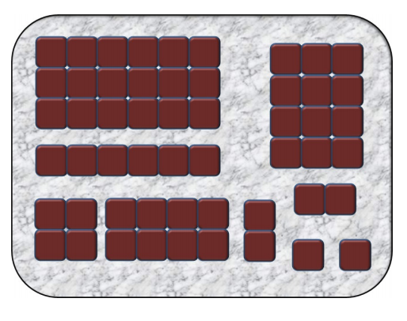

## 문제

John Horton Conway (1937-) is a British mathematician with many contributions to mathematics. He is famous for the invention of the cellular automaton, more popularly known as the “Game of Life.” This problem is inspired by a game Conway invented in the 1970s.

This game is played using a rectangular sheet of brownies fresh out of the oven. The players are Harry Horizontal and Vicky Vertical. Initially, there is a single piece consisting of B × D connected squares (the individual brownies).

At each turn, a player chooses one of the remaining pieces and if possible, cuts it into two smaller pieces such that both pieces have integer breadth and depth. Harry may make only horizontal cuts, Vicky only vertical cuts. Pieces may not be rotated before or after a cut. If a player cannot cut any of the remaining pieces, that player loses.

Let’s consider some examples. The simplest game is . In this case, neither Harry nor Vicky can make a move, so whoever starts loses. On the other hand,  is a win for Harry, no matter who starts. Similarly,  is a win for Vicky, no matter who starts.

Consider , which is a loss for whoever starts. For instance, if Vicky starts, her only move leaves  Harry with ,  and once he cuts any of the pieces, Vicky is left with , ,  (in any order) and thus again without moves. For reasons of symmetry, Harry loses if he is made to start.

Intuition might tell us that Vicky should tend to win if the initial sheet is broader than it is deep (since such sheets yield more opportunities for vertical cuts), but consider . If Harry starts, his only possible move leaves Vicky with ,  and a win. But if Vicky starts, any possible move leaves Harry with , . Harry responds and leaves Vicky with , , , which Vicky will eventually lose since there are no moves left in the 2  sheets and whoever makes the first move on  loses.

On the other hand,  is a winner for Vicky, no matter who starts. If Harry starts, he runs out of moves after his first cut. If Vicky starts, her best move is to cut in the center, leaving Harry with , , which he loses because each  game is lost by whoever moves first.

Given the initial size of the sheet, and given who starts the game, write a program that computes if the starting player has a strategy to force a win!

## 입력

The first line contains an integer 1 ≤ N ≤ 10 denoting the number of test cases that follow. Each test case consists of a single line containing two integers B and D, and a string S. Here B denotes the initial breadth of the sheet (1 ≤ B ≤ 500), D denotes the initial depth of the sheet (1 ≤ D ≤ 500) and S is either Harry or Vicky depending on whether Harry or Vicky moves first.

## 출력

For each test case, output whether the player who starts can force a win in the game. Output the player’s name followed by can win or cannot win.
