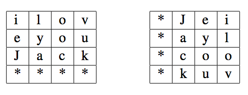

## 문제

Jack and Jill developed a special encryption method, so they can enjoy conversations without worrrying about eavesdroppers. Here is how: let L be the length of the original message, and M be the smallest square number greater than or equal to L. Add (M − L) asterisks to the message, giving a padded message with length M. Use the padded message to fill a table of size K × K, where K2 = M. Fill the table in row-major order (top to bottom row, left to right column in each row). Rotate the table 90 degrees clockwise. The encrypted message comes from reading the message in row-major order from the rotated table, omitting any asterisks.

For example, given the original message ‘iloveyouJack’, the message length is L = 12. Thus the padded message is ‘iloveyouJack\*\*\*\*’, with length M = 16. Below are the two tables before and after rotation.

Then we read the secret message as ‘Jeiaylcookuv’.

## 입력

The first line of input is the number of original messages, 1 ≤ N ≤ 100. The following N lines each have a message to encrypt. Each message contains only characters a–z (lower and upper case), and has length 1 ≤ L ≤ 10 000.

## 출력

For each original message, output the secret message.
