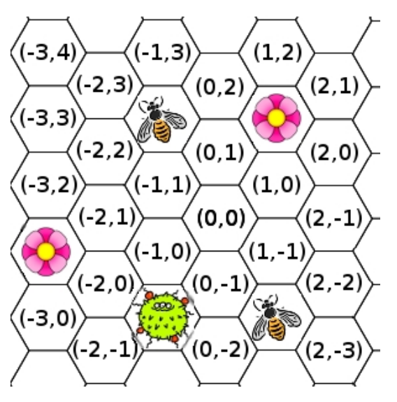

## 문제

In the last couple of months the wretched bee flu has been on the rampage. To battle extinction, the bees of Inner Dreaded Illnessia have set up a system of safe zones in their hives. Sadly, they can’t create such zones everywhere (they need somewhere to place the honey as well), so there is always chaos when the bacteria appear in the hive. You need to help the bees, and figure out how many of them can be saved if they organize themselves optimally.

The beehive is a hexagonal grid (see illustration), and a bee can move from the zone where it’s located to any neighboring one once every second or it can choose to remain in the same cell (clarification). At the same time, the bacteria will spread from every cell containing it to all its six neighbors once every two seconds. Safe zones stay in the same location (of course). If a bee reaches an empty safe zone before the bacteria does, it can withstand infection by staying there until the danger passes. Due to the functioning of these things, only one bee can stay safe at each of these zones at the same time.

## 입력

The first line of input contains a single number T, the number of test cases to follow. Each test case consists of four lines. The first line contains the numbers N, S and B, the number of bees, safe zones and bacteria, respectively. Then follow three lines describing the initial locations of each of these. The first line describes the locations of the N bees, the second the locations of the S safe zones, while the third describes the locations of the B bacteria. Each line is formatted x1y1x2y2...xkyk, where k represents the amount of locations (N, S or B).

* 0 < T ≤ 150
* 0 < N, S ≤ 50
* 0 < B ≤ 1500
* −100 ≤ xi, yi ≤ 100
* The bees make up to two moves before the bacteria spread for the first time (and then two more moves before the spread continues, and so on).
* Though only one bee can stay safe at a single safe zone, there is no problem for bees to stay in the same zone (even safe zones).
* The earliest time a bee can be safe at a safe zone is after their first move. That is, they are not hiding ”just in case”.
* The beehive is very large. For the purposes of this problem, assume that the bees won’t be able to make it outside (without growing tired and having to take a break until the bacteria catches up).

## 출력

For each test case, output one line containing a single number, the maximum amount of bees that can survive the epidemic.
