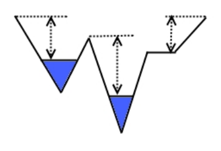

## 문제

Proud Penguin (PP) is one of the hottest attractions in your city. Specializing in the arctic area, they let you see fish, seals, whales and, of course, penguins. The penguins being such a huge success, PP has decided to expand with a whole new area for the penguins to play around on. This new area is shaped as a long, narrow track, consisting of climbs and slides (with the height being highest at the ends, so that a travel always starts with a slide). The penguins will be allowed to enter on one side, and then travel to the other side by waddling, swimming and sliding. Connecting the two current areas, this will make the life of the penguins a lot more varied. Of course, the glass on the one side of the track will provide visitors with a lot more penguin action as well.

PP is now faced with one last problem in the planning stage of the expansion. How should they distribute water along the track? Due to the lazy nature of the penguins, they have decided to go for the solution where the highest climb will be as low as possible. At the same time, the board has decided to cut maintenance costs, and have set a maximum limit on the amount of water to be used.

You are appointed with the task of finding an optimal water distribution along the track. Given the height of the track at evenly spaced intervals and the maximum amount of water you can use, what is the lowest possible maximum climb you will have to leave the penguins with?

Figure 1: Measuring the height of climbs

## 입력

The first line of input contains a single integer T, the number of test cases to follow. Each test case begins with a line containing two integer numbers, N, the length of the track for that test case, and W the amount of water available. Then follow a line containing N + 1 integers ai, where a0 describes the height at the left side, a1 the height one unit from the left side, and so on until number aN, which describes the height at the right side of the track.

* 0 < T ≤ 100
* 0 < N ≤ 10000
* 0 ≤ W ≤ 1000000
* 0 ≤ ai ≤ 100
* a0 = aN = 100
* In your calculations, assume that the width of the track is always one unit, and that the track between two points is a straight line.
* A climb starts at water level or at any land point, and continues upwards until no adjacent point is higher than the current one (ie. a strictly increasing path).
* The height of a climb is defined as the height difference between its lowest and highest point.
* Keep in mind that the penguins will want to travel in both directions.
* Assume that water always runs to a lower adjacent point.
* An error of up to 10−6 will be accepted in the output.

## 출력

For each test case output one line containing a single number, the height of the lowest possible maximum climb for the track in that test case.
