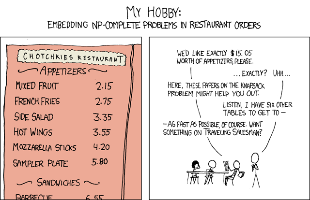

## 문제

A friend of yours who is working as a waiter has a problem. A group of xkcd-fans have started to come to the restaurant and order food as in the comic strip below. Each order takes him a lot of time to figure out, but maybe you can help him.

Figure G.1: Comic strip [xkcd.com/287](./002_287).

You are to write a program that finds out what was ordered given the total cost of the order and the cost of each item on the menu.

## 입력

The input starts with a line containing one integer n (1 ≤ n ≤ 100), the number of items on the menu. The next line contains n space-separated positive integers c1, c2, . . . , cn, denoting the cost of each item on the menu in Swedish kronor. No item costs more than 1 000 SEK.

This is followed by a line containing m (1 ≤ m ≤ 1 000), the number of orders placed, and a line with m orders. Each order is given as an integer s (1 ≤ s ≤ 30 000), the total cost of all ordered items in SEK.

## 출력

For each order in the input output one line as follows. If there is one unique order giving the specified total cost, output a space-separated list of the numbers of the items on that order in ascending order. If the order contains more than one of the same item, print the corresponding number the appropriate number of times. The first item on the menu has number 1, the second 2, and so on.

If there doesn’t exist an order that gives the specified sum, output Impossible. If there are more than one order that gives the specified sum, output Ambiguous.
