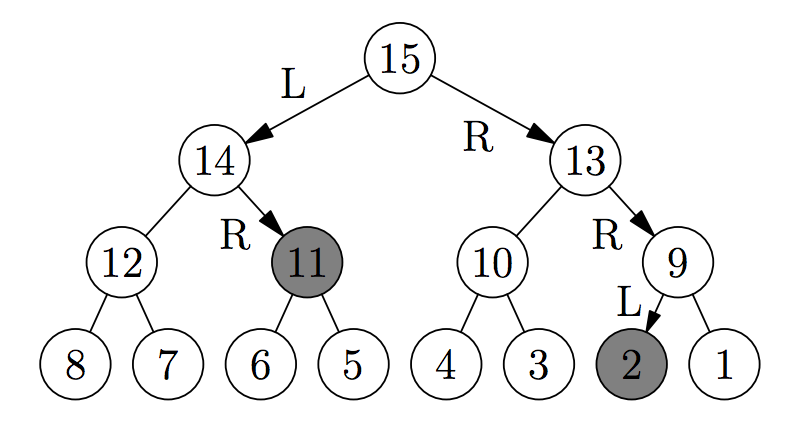

## 문제

Lovisa is at KTH listening to Stefan Nilsson lecturing about perfect binary trees. “A perfect binary tree has a distinguished node called the root which is usually drawn at the top. Each node has two children except the nodes in the lowest layer, which we call leaves.” Lovisa knows all this already, so she is a bit bored. Noticing this, Stefan comes up with a new challenge for Lovisa.

First, we label the nodes of a perfect binary tree with numbers as follows. We start at the bottom right leaf which gets number 1 and then label nodes on the same level in increasing order from right to left. After finishing a level, we move to the rightmost node in the level above and label all the nodes on that level from right to left. We proceed in this fashion until we reach the root.

When we want to describe a node in the tree, we can do it by describing a path starting at the root and going down toward the leaves. At each non-leaf node we can either go left (‘`L`’) or right (‘`R`’).

Figure A.1: Labeled binary tree of height 3 with two marked paths from the root. Path `LR` leads to label 11 while path RRL leads to 2. The root has number 15.

Lovisa’s task is to calculate the label of a node, given the height of the tree H and the description of the path from the root.

## 입력

The only line of input contains the height of the tree H, 1 ≤ H ≤ 30 and a string consisting of the letters ‘`L`’ and ‘`R`’, denoting a path in the tree starting in the root. The letter ‘`L`’ denotes choosing the left child, and the letter ‘`R`’ choosing the right child. The description of the path may be empty and is at most H letters.

## 출력

Output one line containing the label of the node given by the path.
