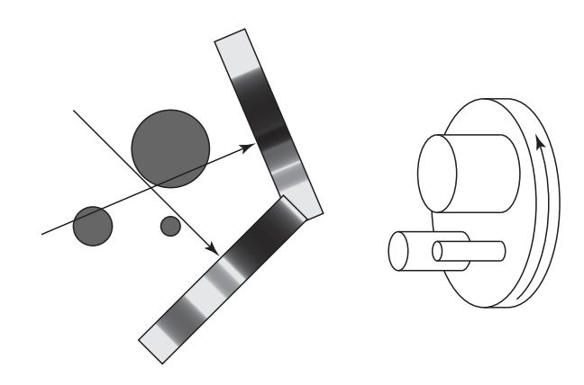

## 문제

Tomosynthesis is a medical imaging modality in which a 3D dataset is obtained algorithmically from a set of X-ray images taken in different directions within a limited range of angles. A larger range of angles normally gives a better reconstruction, but is more difficult to acquire. Arvid is working on a reconstruction algorithm for obtaining the 3D image, but so far it doesn’t seem to work when there are overlapping structures in any of the input images. The sample he will first reconstruct is a test object consisting of parallel equal-length cylinders of varying diameters that will be rotated around the axis of the cylinders.

Figure D.1: To the left, a cross section of the test object of sample input 1. The upper projection is not acceptable since the two larger cylinders overlap. In the lower projection no cylinders overlap, so this direction and a range of angles around it are okay. To the right, an illustration of the same test object from the side.

Disregarding the fact that his algorithm will not work in practice, Arvid asks you for help. What is the largest range of angles in which the test object can be imaged without any cylinders overlapping in any of the images? An image is a plane projection of the structure perpendicular to the axes of the cylinders.

## 입력

The first line of input contains a single integer 2 ≤ N ≤ 100 denoting the number of cylinders that constitute the test object. This is followed by N rows, each containing three floating point numbers x, y and r, denoting the x- and y-coordinate of the center of a cylinder, and the radius of that cylinder, respectively. The coordinates are in the range −1 000 ≤ x, y ≤ 1 000 and the radius 0 < r ≤ 1 000. None of the cylinders touch or overlap

## 출력

Output a single number, the size in radians of the largest continuous range of projection directions over which no cylinders overlap. If no such angle exists output 0. Your answer should have an absolute error of at most 10−8.
