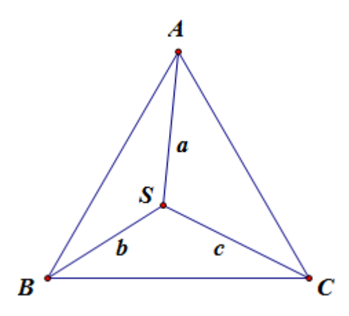

## 문제

The Algebraist Carpet Manufacturing (ACM) group likes to produce area carpets based upon various geometric figures. The 2014 ACM carpets are all equilateral triangles. Unfortunately, due to a manufacturing defect, some of the carpets are not as stainresistant as intended. The ACM group is offering to replace each defective carpet that contains a stain.

The web form used to report the stained carpet requests the three distances that the stain is away from the corners of the rug. Based upon these three numbers, you need to compute the area of the rug that is to be sent to the customer, or indicate that the customer’s carpet doesn’t come from ACM.

## 입력

Each input will consist of a single test case. Note that your program may be run multiple times on different inputs. Each test case will consist of a single line with three floating point numbers a, b and c (0 < a,b,c ≤ 100) representing the distances from the stain to each of the three corners of the carpet. There will be a single space between a and b, and between b and c.

## 출력

Output a single line with a single floating point number. If there is a carpet that satisfies the constraints, output the area of this carpet. If not, output -1.000. Output this number to exactly three decimal places, rounded. Output no spaces.
